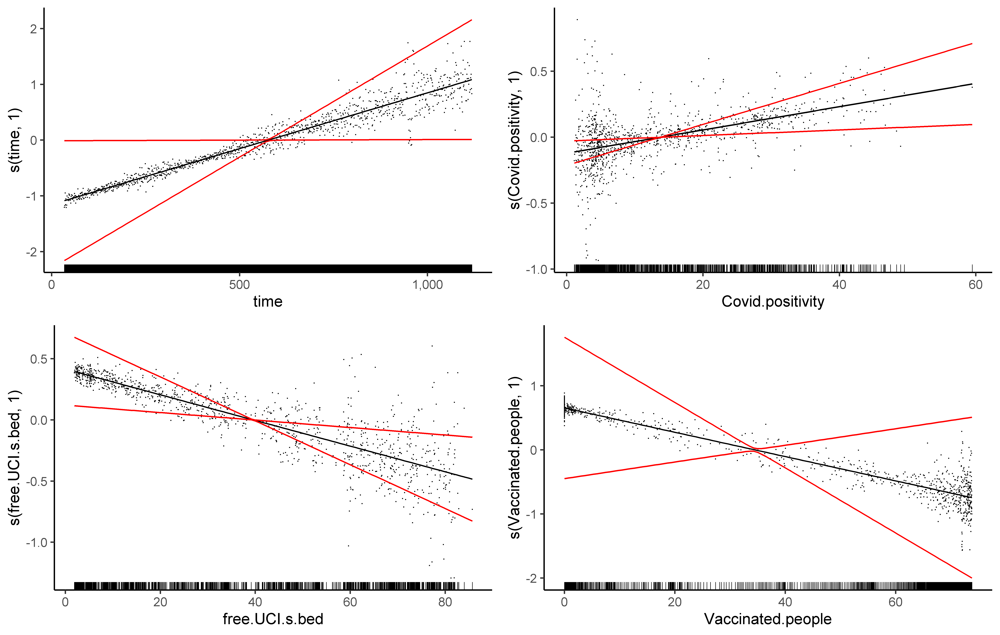
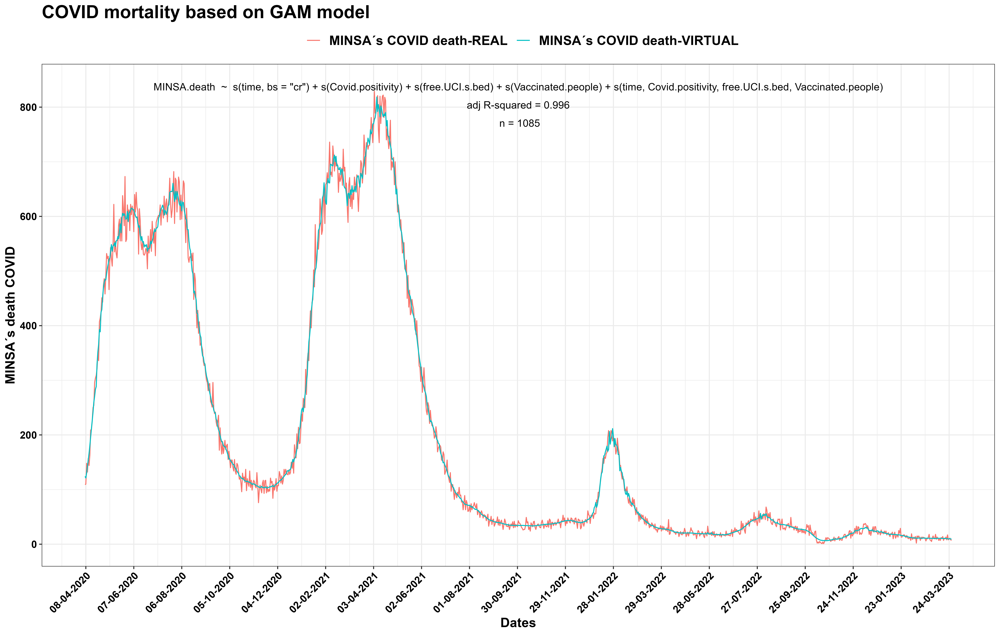

# GAM

## Contents
-   [Introduction](#introduction)
-   [Principal outcomes](#principal-outcomes)
-   [Conclusions](#conclusions)
-   [References](#references)
-   [R code](#r-code)

## Introduction
In the previous stages, COVID-19 data provided by the Peruvian government were analysed to fit statistical and/or mathematical models in order to answer questions about the spread of COVID-19 in Peru. For example, the effectiveness of using vaccination to control COVID-19 and the relationships between COVID-19 deaths, positivity, free ICU beds, and vaccinated people were investigated.

To demonstrate or refute the previously proposed questions, we use Generalized Additive Models (GAMs). GAMs are models similar to Generalized Linear Models that consider the response variables adjusted to the family of exponential functions, but in the case of GAMs, they are associated with a smoothed link function of the predictor variable. This generates great flexibility for model selection but creates the problem of selecting the most optimal model (Wood & Augustin, 2002).

When working with multiple input variables, it is necessary to assign a form of reparameterization of the smoothed variables (Wood, 2017). This can be done in two ways: the first is the reparameterization necessary to absorb the identifiability constraints in the matrix of smoothed input variables, and the second is a reparameterization that helps understand the effective degrees of freedom of each smoothed variable (Wood, 2017).

One advantage of GAMs is that they can handle non-linear relationships between the response and predictor variables, as well as interactions between predictors, in a flexible and computationally efficient way. GAMs are particularly useful in fields like ecology, epidemiology, and finance, where complex non-linear relationships are often encountered. GAMs have been implemented in a variety of software packages, including R (with the mgcv package) and Python (with the pygam package).

##  Principal outcomes

It is possible to use SINADEF's deaths data; however, there is a gap in the data on October 12th, 2022. Therefore, I only used MINSA's deaths data as the COVID-19 mortality index.

### GAM on MINSA´s deaths
|[](https://github.com/jasb3110/COVIDPERU/blob/5377a555cd47975a35802003c1453d5f49c2335c/plotting/MINSA.4var.covid.gam.all.png?raw=true)|
|:------------------------------------------------------:|
|*Figure 1. MINSA's deaths  inferred for GAM: time, Molecular positivity, free ICU´s bed, and Vaccinated people*| 

In Fig.1, an autoregressive GAM model is presented, which demonstrates the relationship between SINADEF's time series data, including Molecular positivity, free ICU's bed, and Vaccinated people as input data, to infer MINSA's deaths. The model suggests that as time and COVID-19 positivity increase, MINSA's deaths also increase. However, the negative relationship between free ICU beds and vaccinated people with MINSA's deaths suggests that these factors may play a role in mitigating COVID-19 mortality. 

|[](https://github.com/jasb3110/COVIDPERU/blob/5377a555cd47975a35802003c1453d5f49c2335c/plotting/MINSA.gam.model.compare.all.png?raw=true)|
|:------------------------------------------------------:|
|*Figure 2. MINSA's deaths  real versus MINSA's deaths  virtual inferred for GAM*| 

In Fig. 2, I attempted to reconstruct the COVID-19 mortality rate up to the present using an autoregressive GAM. This graph allows us to assess the extent to which the GAM model fits with MINSA's reported deaths.

## Conclusions

It has been possible to successfully fit MINSA's deaths in an autoregressive GAM model. It suggests that the increase in the number of free ICU beds and the number of vaccinated people has a positive impact on the health of Peruvians and can help reduce COVID-19 mortality rates. This information could be valuable for the government in promoting vaccination campaigns and improving the healthcare infrastructure.

## References

- Wood, S. N., & Augustin, N. H. (2002). GAMs with integrated model selection using penalized regression splines and applications to environmental modelling. Ecological Modelling, 157(2–3), 157–177. https://doi.org/10.1016/S0304-3800(02)00193-X
- Wood S (2017). Generalized Additive Models: An Introduction with R, 2 edition. Chapman and Hall/CRC.

## R code
Bellow I attached a R-script. [Contact Us](mailto:solisbenites.jose@gmail.com) here, if you consider to give opinions, suggestions and questions.

``` markdown
################################################################################
#to start

library("ggplot2")
library("mgcv")
library("mgcViz")
library("itsadug")
library("visreg")
library("gridExtra")
library("magrittr")
library("devtools")
library("gamm4")

####
ggplotRegression<- function (fit) {
  
  if(round(fit$coef[[1]],2)==0){
    a=format(fit$coefficients[[1]], scientific = TRUE)
  }else{
    a=round(fit$coef[[1]],2)
  }
  
  if(round(fit$coef[[2]],2)==0){
    b=format(fit$coefficients[[2]], scientific = TRUE)
  }else{
    b=round(fit$coef[[2]],2)
  }
  
  if(round(summary(fit)$coef[2,4],2)==0){
    pv="p < 0.001"
  }else{
    pv="p > 0.001"
  }

  Label=paste0("y = ",a," + ",
               b,"x\n",
               "adj R-squared"," = ",round(summary(fit)$r.squared,3),"\n",
               "  n = ",length(fit$fitted.values),"\n",
              pv)
  
  ggplot(fit$model, aes_string(x = names(fit$model)[2], y = names(fit$model)[1])) + 
    geom_point() +
    stat_smooth(method = "lm",se=TRUE,col="black") +
    scale_x_continuous(limits = c((-.2*abs(min(as.numeric(fit$model[[2]]),na.rm=TRUE))+min(as.numeric(fit$model[[2]]),na.rm=TRUE)),(.2*abs(max(as.numeric(fit$model[[2]]),na.rm=TRUE))+max(as.numeric(fit$model[[2]]),na.rm=TRUE))),labels = scales::comma,breaks =scales::pretty_breaks(n = 5))+
    scale_y_continuous(limits = c((-.2*abs(min(as.numeric(fit$model[[1]]),na.rm=TRUE))+min(as.numeric(fit$model[[1]]),na.rm=TRUE)),(.2*abs(max(as.numeric(fit$model[[1]]),na.rm=TRUE))+max(as.numeric(fit$model[[1]]),na.rm=TRUE))),labels = scales::comma,breaks =scales::pretty_breaks(n = 5))+
    annotate(geom = 'text', x =(.6*abs(min(as.numeric(fit$model[[2]]),na.rm=TRUE))+min(as.numeric(fit$model[[2]]),na.rm=TRUE)), y =(.1*abs(max(as.numeric(fit$model[[1]]),na.rm=TRUE))+max(as.numeric(fit$model[[1]]),na.rm=TRUE)), label =Label, parse=F)+
    theme_bw()
}
####

c.gam=as.data.frame(c.var)
c.gam$vac.rate=c(0,diff(c.gam$Vaccinated.people))

#to assume after 7 month, the vaccination protection varnish

c.gam$Vaccinated.people2=c.gam$Vaccinated.people
c.gam$Vaccinated.people2[(7*30+1):length(c.gam$Vaccinated.people)]=c.gam$Vaccinated.people[(7*30+1):length(c.gam$Vaccinated.people)]-c.gam$Vaccinated.people[1:(length(c.gam$Vaccinated.people)-7*30)]
#to reduce a vaccination effet on
bestNormalize(c.gam$Vaccinated.people)
peso=predict(orderNorm(c.gam$Vaccinated.people))
c.gam$peso=(peso*-1+max(peso))/(1*max(peso))
c.gam$peso2=0.01+c.gam$peso/median(c.gam$peso)

#linear relationship for 4 variables in GAM
cc.gam<-gam(MINSA.death~time+
              Covid.positivity+
              free.ICU.s.bed+
              Vaccinated.people+
              time*Covid.positivity*free.ICU.s.bed*Vaccinated.people
              ,family =tw,data =c.gam)

gam.check(cc.gam)
summary(cc.gam)

#linear relationship for 3 variables in GAM
cc.gam2<-gam(MINSA.death~
              Covid.positivity+
               free.ICU.s.bed+
               Vaccinated.people+
              Covid.positivity*free.ICU.s.bed*Vaccinated.people
            ,family =tw,data =c.gam)

gam.check(cc.gam2)
summary(cc.gam2)

#Smooth relationship for 4 variables & interaction in GAM
cc.gam.all<-gam(MINSA.death~s(time,bs="cr")+
                  s(Covid.positivity)+
                  s(free.ICU.s.bed)+
                  s(Vaccinated.people)+
                  s(time,Covid.positivity,free.ICU.s.bed,Vaccinated.people)
                ,family =tw,data =c.gam)

gam.check(cc.gam.all)
summary(cc.gam.all)

#Smooth relationship for 3 variables & interaction in GAM
cc.gam.all2<-gam(MINSA.death~
                   s(Covid.positivity)+
                   s(free.ICU.s.bed)+
                   s(Vaccinated.people)+
                  s(Covid.positivity,free.ICU.s.bed,Vaccinated.people)
                ,family =tw,data =c.gam)

gam.check(cc.gam.all2)
summary(cc.gam.all)

#Smooth relationship for 4 variables, just interaction in GAM
cc.gam.all3<-gam(MINSA.death~
                   s(time,Covid.positivity,free.ICU.s.bed,Vaccinated.people)
                 ,family =tw,data =c.gam)

gam.check(cc.gam.all3)
summary(cc.gam.all3)

#Smooth relationship for 3 variables, just interaction in GAM
cc.gam.all4<-gam(MINSA.death~ s(Covid.positivity,free.ICU.s.bed,Vaccinated.people)
                 ,family =tw,data =c.gam)

gam.check(cc.gam.all4)
summary(cc.gam.all4)

#autocorrelation without specific lag
cc.gam.all.au<-gamm(MINSA.death~s(time,bs="cr")+            
                    s(Covid.positivity)+
                    s(free.ICU.s.bed)+
                    s(Vaccinated.people)+
                    s(time,Covid.positivity,free.ICU.s.bed,Vaccinated.people)
                    #,weights = c.gam$peso2/c.gam$peso2[1]
                    ,control = list(niterEM =0, optimMethod = "BFGS",opt = "optim",niterPQL=20)
                    ,family =tw,method = "REML",data =c.gam)

gam.check(cc.gam.all.au$gam)# it is a best model!!!!!!!!!!!!!
summary(cc.gam.all.au$gam)

cc.gam.all.au1<-gamm(MINSA.death~            
                       s(Covid.positivity)+
                       s(free.ICU.s.bed)+
                       s(Vaccinated.people)+
                      s(Covid.positivity,free.ICU.s.bed,Vaccinated.people)
                     #,weights = c.gam$peso2/c.gam$peso2[1]
                    ,control = list(niterEM =0, optimMethod = "BFGS",opt = "optim",niterPQL=20)
                    ,family =tw,method = "REML",data =c.gam)

gam.check(cc.gam.all.au1$gam)
summary(cc.gam.all.au1$gam)

#autocorrelation by 1 lag

cc.gam.all.au2<-gamm(MINSA.death~s(time,bs="cr")+            
                       s(Covid.positivity)+
                       s(free.ICU.s.bed)+
                       s(Vaccinated.people)+
                       s(time,Covid.positivity,free.ICU.s.bed,Vaccinated.people) 
                     #,weights = c.gam$peso2/c.gam$peso2[1]
                     ,family =tw,method = "REML",data =c.gam
                     ,control = list(niterEM = 0, optimMethod = "BFGS",opt = "optim",niterPQL=20)
                     , correlation = corARMA(form = ~1|time,p = 1))

gam.check(cc.gam.all.au2$gam)
summary(cc.gam.all.au2$gam)


gam.acf=acf(resid(cc.gam.all.au2$lme, type = "normalized"), lag.max = 36, main = "ACF")
gam.pacf=pacf(resid(cc.gam.all.au2$lme, type = "normalized"), lag.max = 36, main = "pACF")
gam.acf.pos=which(gam.acf$acf==min(gam.acf$acf))
gam.acf$acf[2]
gam.pacf.pos=which(gam.pacf$acf==min(gam.pacf$acf))

cc.gam.all.au2.1<-gamm(MINSA.death~              
                         s(Covid.positivity)+
                         s(free.ICU.s.bed)+
                         s(Vaccinated.people)+
                         s(Covid.positivity,free.ICU.s.bed,Vaccinated.people)
                     #,weights = c.gam$peso2/c.gam$peso2[1]
                     ,family =tw,method = "REML",data =c.gam
                     ,control = list(niterEM = 0, optimMethod = "BFGS",opt = "optim",niterPQL=20)
                     , correlation = corARMA(form = ~1|time,p = 1))

gam.check(cc.gam.all.au2.1$gam)
summary(cc.gam.all.au2.1$gam)

gam.acf2=acf(resid(cc.gam.all.au2.1$lme, type = "normalized"), lag.max = 36, main = "ACF")
gam.pacf2=pacf(resid(cc.gam.all.au2.1$lme, type = "normalized"), lag.max = 36, main = "pACF")
gam.acf.pos2=which(gam.acf2$acf==min(gam.acf2$acf))
gam.acf2$acf[2]
gam.pacf.pos2=which(gam.pacf2$acf==min(gam.pacf2$acf))

cc.gam.all.au3<-gamm(MINSA.death~s(time,bs="cr")+
                       s(Covid.positivity)+
                       s(free.ICU.s.bed)+
                       s(Vaccinated.people)+
                       s(time,Covid.positivity,free.ICU.s.bed,Vaccinated.people)
                     #,weights = c.gam$peso2/c.gam$peso2[1]
                     ,correlation = corARMA(form = ~1|time,p = 1,value = gam.acf$acf[2])
                     ,family =tw,method = "REML",data =c.gam
                     ,control = list(niterEM = 0, optimMethod = "BFGS"
                                     ,opt = "optim",niterPQL=20))

gam.check(cc.gam.all.au3$gam)
summary(cc.gam.all.au3$gam)

cc.gam.all.au3.1<-gamm(MINSA.death~
                       s(Covid.positivity)+
                       s(free.ICU.s.bed)+
                       s(Vaccinated.people)+
                       s(Covid.positivity,free.ICU.s.bed,Vaccinated.people)
                     #,weights = c.gam$peso2/c.gam$peso2[1]
                     ,correlation = corARMA(form = ~1|time,p = 1,value = gam.acf2$acf[2])
                     ,family =tw,method = "REML",data =c.gam
                     ,control = list(niterEM = 0, optimMethod = "BFGS"
                                     ,opt = "optim",niterPQL=20))

gam.check(cc.gam.all.au3.1$gam)
summary(cc.gam.all.au3.1$gam)

AIC(cc.gam,cc.gam2,cc.gam.all,cc.gam.all2,cc.gam.all3,cc.gam.all4,cc.gam.all.au$lme,cc.gam.all.au1$lme,cc.gam.all.au2$lme,cc.gam.all.au2.1$lme,cc.gam.all.au3$lme,cc.gam.all.au3.1$lme)# to choose a best model 
BIC(cc.gam,cc.gam2,cc.gam.all,cc.gam.all2,cc.gam.all3,cc.gam.all4,cc.gam.all.au$lme,cc.gam.all.au1$lme,cc.gam.all.au2$lme,cc.gam.all.au2.1$lme,cc.gam.all.au3$lme,cc.gam.all.au3.1$lme)# to choose a best model

#for 4 variables
gam.outcome.all=as.data.frame(capture.output(summary(cc.gam.all.au$gam)))
write.csv(gam.outcome.all,"gam.outcome.all2.csv",sep=",",dec=".",row.names = FALSE)

#for 3 variables
gam.outcome.all2=as.data.frame(capture.output(summary(cc.gam.all.au1$gam)))
write.csv(gam.outcome.all2,"gam.outcome.all2.csv",sep=",",dec=".",row.names = FALSE)

gam_errors.all <- residuals(cc.gam.all.au2$lme, type = "response")
gam_errors.all2 <- residuals(cc.gam.all.au1$lme, type = "response")
error_mod.all <- auto.arima(gam_errors.all)
error_mod.all2 <- auto.arima(gam_errors.all2)
error_mod.all
error_mod.all2
checkresiduals(error_mod.all, theme = theme_bw())
checkresiduals(error_mod.all2, theme = theme_bw())

png("MINSA.4var.covid.gam.check.all.png", width = 250, height = 159, units = 'mm', res =600)
par(mfrow=c(2,2))
gam.check(cc.gam.all.au$gam)
dev.off()

png("MINSA.3var.covid.gam.check.all2.png", width = 250, height = 159, units = 'mm', res =600)
par(mfrow=c(2,2))
gam.check(cc.gam.all.au1$gam)
dev.off()

viz.covid.all=getViz(cc.gam.all.au$gam)
tr.covid.all <- plot(viz.covid.all, allTerms = T) +
  l_points() +
  l_fitLine(linetype = 1)  +
  l_ciLine(linetype =1,col="red") +
  l_rug() +
  scale_x_continuous(labels = scales::comma,breaks =scales::pretty_breaks(n = 4))+
  scale_y_continuous(labels = scales::comma,breaks =scales::pretty_breaks(n = 4))+
  theme_classic()

viz.covid.all2=getViz(cc.gam.all.au1$gam)
tr.covid.all2 <- plot(viz.covid.all2, allTerms = T) +
  l_points() +
  l_fitLine(linetype = 1)  +
  l_ciLine(linetype =1,col="red") +
  l_rug() +
  scale_x_continuous(labels = scales::comma,breaks =scales::pretty_breaks(n = 4))+
  scale_y_continuous(labels = scales::comma,breaks =scales::pretty_breaks(n = 4))+
  theme_classic() 

png("MINSA.4var.covid.gam.all.png", width = 250, height = 159, units = 'mm', res =600)
print(tr.covid.all, pages = 1)
dev.off()

png("MINSA.3var.covid2.gam.all.png", width = 250, height = 159, units = 'mm', res =600)
print(tr.covid.all2, pages = 1)
dev.off()

#heat map with 4 variables, just GAM MODEL , not GAMM

png("MINSA.4var.covid.heat.map.all.png", width = 250, height = 159, units = 'mm', res =400)
visreg2d(cc.gam.all,"Covid.positivity","free.ICU.s.bed",xlab="Covid posisitivity %",ylab="Free ICU´s beds %",main=NA)
dev.off()

png("MINSA.4var.covid.heat2.map.png", width = 250, height = 159, units = 'mm', res =400)
visreg2d(cc.gam.all,"free.ICU.s.bed","Vaccinated.people",xlab="Free ICU´s beds %",ylab="Vaccination %",main=NA)
dev.off()

png("MINSA.4var.covid.heat3.map.png", width = 250, height = 159, units = 'mm', res =400)
visreg2d(cc.gam.all,"Covid.positivity","Vaccinated.people",xlab="Covid posisitivity %",ylab="Vaccination %",main=NA)
dev.off()

png("MINSA.4var.covid.heat4.map.png", width = 250, height = 159, units = 'mm', res =400)
visreg2d(cc.gam.all,"time","Covid.positivity",xlab="Days to begin COVID´s spreading",ylab="Covid posisitivity %",main=NA)
dev.off()

#heat map with 3 variables

png("MINSA.3var.covid.heat.map2.png", width = 250, height = 159, units = 'mm', res =400)
visreg2d(cc.gam.all4,"Covid.positivity","free.ICU.s.bed",xlab="Covid posisitivity %",ylab="Free ICU´s beds %",main=NA)
dev.off()

png("MINSA.3var.covid.heat2.map2.png", width = 250, height = 159, units = 'mm', res =400)
visreg2d(cc.gam.all4,"free.ICU.s.bed","Vaccinated.people",xlab="Free UCI´s beds %",ylab="Vaccination %",main=NA)
dev.off()

png("MINSA.3var.covid.heat3.map2.png", width = 250, height = 159, units = 'mm', res =400)
visreg2d(cc.gam.all4,"Covid.positivity","Vaccinated.people",xlab="Covid posisitivity %",ylab="Vaccination %",main=NA)
dev.off()

################################################################################
#GAM 4 variables 
newd.all=data.frame(time=c.gam$time,
                Covid.positivity=c.gam$Covid.positivity,
                free.ICU.s.bed=c.gam$free.ICU.s.bed,
                Vaccinated.people=c.gam$Vaccinated.people)

cc.gam.pred.all=data.frame(predict.gam(cc.gam.all.au$gam,newd.all, type="response",se.fit =T ))

fecha.inicio.gam=as.Date("2020-3-4",format="%Y-%m-%d")

dvv.all=data.frame(cbind(as.Date(c(rep(as.character(inicio.pandemia+as.numeric(c.var[,1])),2)),format="%Y-%m-%d"),
                     c(c.gam$MINSA.death, cc.gam.pred.all$fit),
                     c(rep("MINSA´s COVID death-REAL",length(c.var[,2])),
                       rep("MINSA´s COVID death-VIRTUAL",length(c.var[,2])))))

dvv.all$X1=as.Date(c(rep(as.character(inicio.pandemia+as.numeric(c.var[,1])),2)),format="%Y-%m-%d")

dvv.all$X1=as.Date(dvv.all$X1,format="%Y-%m-%d")
dvv.all$X2=as.numeric(dvv.all$X2)
dvv.all$X3=as.factor(dvv.all$X3)
#View(dvv.all)

Label.gam=paste(as.character(cc.gam.all.au$gam$formula)[2]," ~ ",as.character(cc.gam.all.au$gam$formula)[3])
Label.gam2=paste0("adj R-squared = ",round(summary(cc.gam.all.au$gam)[[10]],3))
Label.gam3=paste0(" n = ",summary(cc.gam.all.au$gam)[[13]])

gam.model.all=ggplot(data=dvv.all, aes(x =dvv.all$X1, y =dvv.all$X2))+
  geom_line(aes(color=dvv.all$X3),size=.5)+
  scale_x_date(date_breaks = "60 days",date_labels = "%d-%m-%Y")+
  labs(colour="",title="COVID mortality based on GAM model",
       x ="Dates", 
       y = "MINSA´s death COVID")+
  scale_y_continuous(limits = c(.95*min(dvv.all$X2,na.rm = TRUE),1.01*max(dvv.all$X2,na.rm = TRUE)),labels = scales::comma,breaks =scales::pretty_breaks(n = 5))+
  theme_bw()+
  theme(legend.position="top",legend.text = element_text(color = "black", size = 14,face="bold"),
        axis.text.x=element_text(size=11,colour = "black",face="bold",angle=45, hjust=1),
        axis.text.y=element_text(size=11,colour = "black",face="bold",hjust=1),
        axis.title=element_text(size=14,face="bold"),title = element_text(size=16,colour = "black",face="bold"))+
  annotate(geom = 'text', x =mean(dvv.all$X1,na.rm=TRUE), y =max(dvv.all$X2,na.rm=TRUE)*1.01, label =Label.gam, parse=F)+
  annotate(geom = 'text', x =mean(dvv.all$X1,na.rm=TRUE), y =max(dvv.all$X2,na.rm=TRUE)*.97, label =Label.gam2, parse=F)+
  annotate(geom = 'text', x =mean(dvv.all$X1,na.rm=TRUE), y =max(dvv.all$X2,na.rm=TRUE)*.93, label =Label.gam3, parse=F)

ggsave("MINSA.gam.model.compare.all.png", dpi = 600,   width = 375,
       height = 238.5,unit="mm",plot =gam.model.all)

####
#GAM 3 variables 

newd.all2=data.frame(Covid.positivity=c.gam$Covid.positivity,
                 free.ICU.s.bed=c.gam$free.ICU.s.bed,
                 Vaccinated.people=c.gam$Vaccinated.people)

cc.gam.pred.all2=data.frame(predict.gam(cc.gam.all.au1$gam,newd.all2,type="response",se.fit =T))

dvv.all2=data.frame(cbind(as.Date(c(rep(as.character(inicio.pandemia+as.numeric(c.var[,1])),2)),format="%Y-%m-%d"),
                      c(c.gam$MINSA.death, cc.gam.pred.all2$fit),
                      c(rep("MINSA´s COVID death-REAL",length(c.gam$MINSA.death)),
                        rep("MINSA´s COVID death-VIRTUAL",length(c.gam$MINSA.death)))))

dvv.all2$X1=as.Date(c(rep(as.character(inicio.pandemia+as.numeric(c.var[,1])),2)),format="%Y-%m-%d")

dvv.all2$X1=as.Date(dvv.all2$X1,format="%Y-%m-%d")
dvv.all2$X2=as.numeric(dvv.all2$X2)
dvv.all2$X3=as.factor(dvv.all2$X3)

Label.gam.2=paste(as.character(cc.gam.all.au3.1$gam$formula)[2]," ~ ",as.character(cc.gam.all.au3.1$gam$formula)[3])
Label.gam2.2=paste0("adj R-squared = ",round(summary(cc.gam.all.au3.1$gam)[[10]],3))
Label.gam3.2=paste0(" n = ",summary(cc.gam.all.au3.1$gam)[[13]])

gam.model.all2=ggplot(data=dvv.all2, aes(x =dvv.all2$X1, y =dvv.all2$X2))+
  geom_line(aes(color=dvv.all2$X3),size=.5)+
  scale_x_date(date_breaks = "60 days",date_labels = "%d-%m-%Y")+
  labs(colour="",title="COVID mortality based on GAM model", 
       x ="Dates", 
       y = "MINSA´s death COVID")+
  scale_y_continuous(limits = c(.95*min(dvv.all2$X2,na.rm = TRUE),1.01*max(dvv.all2$X2,na.rm = TRUE)),labels = scales::comma,breaks =scales::pretty_breaks(n = 5))+
  theme_bw()+
  theme(legend.position="top",legend.text = element_text(color = "black", size = 14,face="bold"),
        axis.text.x=element_text(size=11,colour = "black",face="bold",angle=45, hjust=1),
        axis.text.y=element_text(size=11,colour = "black",face="bold",hjust=1),
        axis.title=element_text(size=14,face="bold"),title = element_text(size=16,colour = "black",face="bold"))+
  annotate(geom = 'text', x =mean(dvv.all2$X1,na.rm=TRUE), y =max(dvv.all2$X2,na.rm=TRUE)*1.01, label =Label.gam.2, parse=F)+
  annotate(geom = 'text', x =mean(dvv.all2$X1,na.rm=TRUE), y =max(dvv.all2$X2,na.rm=TRUE)*.97, label =Label.gam2.2, parse=F)+
  annotate(geom = 'text', x =mean(dvv.all2$X1,na.rm=TRUE), y =max(dvv.all2$X2,na.rm=TRUE)*.93, label =Label.gam3.2, parse=F)

ggsave("MINSA.gam.model.compare.all2.png", dpi = 600,   width = 375,
       height = 238.5,unit="mm",plot =gam.model.all2)

gam.com=lm(cc.gam.all.au$gam$fitted.values~cc.gam.all.au3.1$gam$fitted.values)
ggplotRegression(gam.com)

################################################################################
#GAM with excess of deaths

cc=data.frame(c.gam[1:921,])

cc$peso= c.gam$peso2[1:921]/c.gam$peso2[1]

g.sinadef.minsa=gam(Sinadef.death~
                       time*MINSA.death
                     ,data =cc, family=tw)

gam.check(g.sinadef.minsa)
summary(g.sinadef.minsa)

g.sinadef.minsa2=gam(Sinadef.death~s(time,bs="ts")+
                       s(MINSA.death)+
                     s(time,MINSA.death)+
                     time*MINSA.death
                       ,family =tw,method = "REML",data =cc)

gam.check(g.sinadef.minsa2)
summary(g.sinadef.minsa2)

g.sinadef.minsa3=gamm(Sinadef.death~s(time,bs="ts")+
                        s(MINSA.death)+
                        s(time,MINSA.death)
                     ,control = list(niterEM = 0, optimMethod = "BFGS",opt = "optim",niterPQL=20)
                     ,correlation = corARMA(form = ~1|time,p = 1)
                     ,family =tw,method = "REML",data =cc)

gam.check(g.sinadef.minsa3$gam)
summary(g.sinadef.minsa3$gam)

g.sinadef.minsa4=gamm(Sinadef.death~s(time,bs="ts")+
                        s(MINSA.death)+
                        ti(MINSA.death,time)
                      ,control = list(niterEM = 0, optimMethod = "BFGS",opt = "optim",niterPQL=20)
                      ,correlation = corARMA(form = ~1|time,p = 1)
                      ,family =tw,method = "REML",data =cc)

gam.check(g.sinadef.minsa4$gam)
summary(g.sinadef.minsa4$gam)

################################################################################

gam.sinadef.minsa=gamm(Sinadef.death~s(time,bs="ts")+
                          s(MINSA.death)+
                          s(Covid.positivity)+
                          s(free.ICU.s.bed)+
                          s(Vaccinated.people2)+
                          s(time,MINSA.death,Covid.positivity,free.ICU.s.bed,Vaccinated.people2)
                          ,weights = peso
                          ,family =tw,method = "REML",data =cc
                          ,control = list(niterEM = 0, optimMethod = "BFGS",opt = "optim",niterPQL=20)
                          ,correlation = corARMA(form = ~1|time,p = 1))

gam.check(gam.sinadef.minsa$gam)
summary(gam.sinadef.minsa$gam)


gam.sinadef.minsa2=gamm(Sinadef.death~s(time,bs="ts")+
                          s(MINSA.death)+
                          s(Covid.positivity)+
                          s(free.ICU.s.bed)+
                          s(Vaccinated.people2)+
                          s(time,MINSA.death,Covid.positivity,free.ICU.s.bed,Vaccinated.people2)
                        ,family =tw,method = "REML",data =cc
                        ,control = list(niterEM = 0, optimMethod = "BFGS",opt = "optim",niterPQL=20)
                        ,correlation = corARMA(form = ~1|time,p = 1))

gam.check(gam.sinadef.minsa2$gam)
summary(gam.sinadef.minsa2$gam)


gam.sinadef.minsa3=gamm(Sinadef.death~s(time,bs="ts")+
                         s(MINSA.death)+
                         s(Covid.positivity)+
                         s(free.ICU.s.bed)+
                         s(Vaccinated.people)+
                         s(time,MINSA.death,Covid.positivity,free.ICU.s.bed,Vaccinated.people)
                       ,weights = peso
                       ,family =tw,method = "REML",data =cc
                       ,control = list(niterEM = 0, optimMethod = "BFGS",opt = "optim",niterPQL=20)
                       ,correlation = corARMA(form = ~1|time,p = 1))

gam.check(gam.sinadef.minsa3$gam)
summary(gam.sinadef.minsa3$gam)


gam.sinadef.minsa4=gamm(Sinadef.death~s(time,bs="ts")+
                          s(MINSA.death)+
                          s(Covid.positivity)+
                          s(free.ICU.s.bed)+
                          s(Vaccinated.people)+
                          s(time,MINSA.death,Covid.positivity,free.ICU.s.bed,Vaccinated.people)
                        ,family =tw,method = "REML",data =cc
                        ,control = list(niterEM = 0, optimMethod = "BFGS",opt = "optim",niterPQL=20)
                        ,correlation = corARMA(form = ~1|time,p = 1))

gam.check(gam.sinadef.minsa4$gam)
summary(gam.sinadef.minsa4$gam)


##############################################################################

ccc.gam<-gam(Sinadef.death~s(time,bs="ts")+
              s(Covid.positivity)+
              s(free.ICU.s.bed)+
              s(Vaccinated.people)+
              s(time,Covid.positivity,free.ICU.s.bed,Vaccinated.people)
            ,family =tw,data =cc,method = "REML")

gam.check(ccc.gam)
summary(ccc.gam)

ccc.gam1<-gam(Sinadef.death~s(time,bs="ts")+
               s(Covid.positivity)+
               s(free.ICU.s.bed)+
               s(Vaccinated.people2)+
               s(time,Covid.positivity,free.ICU.s.bed,Vaccinated.people2)
             ,family =tw,data =cc,method = "REML")

gam.check(ccc.gam1)
summary(ccc.gam1)

ccc.gam.au<-gamm(Sinadef.death~s(time,bs="ts")+
         s(Covid.positivity)+
         s(free.ICU.s.bed)+
         s(Vaccinated.people)+
         s(time,Covid.positivity,free.ICU.s.bed,Vaccinated.people)
         ,weights = peso
        ,family =tw,method = "REML",data =cc
        ,control = list(niterEM = 0, optimMethod = "BFGS",opt = "optim",niterPQL=20)
        ,correlation = corARMA(form = ~1|time,p = 1))

gam.check(ccc.gam.au$gam)
summary(ccc.gam.au$gam)

ccc.gam.au.1<-gamm(Sinadef.death~s(time,bs="ts")+
                   s(Covid.positivity)+
                   s(free.ICU.s.bed)+
                   s(Vaccinated.people)+
                   s(time,Covid.positivity,free.ICU.s.bed,Vaccinated.people)
                 ,family =tw,method = "REML",data =cc
                 ,control = list(niterEM = 0, optimMethod = "BFGS",opt = "optim",niterPQL=20)
                 ,correlation = corARMA(form = ~1|time,p = 1))

gam.check(ccc.gam.au.1$gam)
summary(ccc.gam.au.1$gam)

ccc.gam2<-gam(Sinadef.death~
               s(Covid.positivity)+
               s(free.ICU.s.bed)+
               s(Vaccinated.people2)+
               s(Covid.positivity,free.ICU.s.bed,Vaccinated.people2)
             ,family =tw,data =cc,method = "REML")

gam.check(ccc.gam2)#no use

ccc.gam.au2<-gamm(Sinadef.death~
                   s(free.ICU.s.bed)+
                   s(Vaccinated.people2)+
                   s(Covid.positivity,free.ICU.s.bed,Vaccinated.people2)
                 ,weights = peso
                 ,family =tw,method = "REML",data =cc
                 ,control = list(niterEM = 0, optimMethod = "BFGS",opt = "optim",niterPQL=20)
                 , correlation = corARMA(form = ~1|time,p = 1))

gam.check(ccc.gam.au2$gam)
summary(ccc.gam.au2$gam)

ccc.gam.au2.1<-gamm(Sinadef.death~
                    s(free.ICU.s.bed)+
                    s(Vaccinated.people2)+
                    s(Covid.positivity,free.ICU.s.bed,Vaccinated.people2)
                  ,family =tw,method = "REML",data =cc
                  ,control = list(niterEM = 0, optimMethod = "BFGS",opt = "optim",niterPQL=20)
                  , correlation = corARMA(form = ~1|time,p = 1))

gam.check(ccc.gam.au2.1$gam)
summary(ccc.gam.au2.1$gam)

AIC(g.sinadef.minsa,g.sinadef.minsa2,g.sinadef.minsa3$lme,g.sinadef.minsa4$lme,gam.sinadef.minsa$lme,gam.sinadef.minsa2$lme,gam.sinadef.minsa3$lme,gam.sinadef.minsa4$lme,
    ccc.gam,ccc.gam1,ccc.gam.au$lme,ccc.gam.au.1$lme,ccc.gam2,ccc.gam.au2$lme,ccc.gam.au2.1$lme)

BIC(g.sinadef.minsa,g.sinadef.minsa2,g.sinadef.minsa3$lme,g.sinadef.minsa4$lme,gam.sinadef.minsa$lme,gam.sinadef.minsa2$lme,gam.sinadef.minsa3$lme,gam.sinadef.minsa4$lme,
    ccc.gam,ccc.gam1,ccc.gam.au$lme,ccc.gam.au.1$lme,ccc.gam2,ccc.gam.au2$lme,ccc.gam.au2.1$lme)

gam.com2=lm(cc$Sinadef.death~ccc.gam.au.1$gam$fitted.values)
ggplotRegression(gam.com2)

 gam.com3=lm(cc$Sinadef.death~g.sinadef.minsa3$gam$fitted.values)
ggplotRegression(gam.com3)

gam.outcome3=as.data.frame(capture.output(summary(ccc.gam.au.1$gam)))
write.csv(gam.outcome3,"gam.outcome3.csv",sep=",",dec=".",row.names = FALSE)

############################################################################

gam_errors3 <- residuals(ccc.gam.au.1$lme, type = "response")
error_mod3 <- auto.arima(gam_errors3)
error_mod3
checkresiduals(error_mod3, theme = theme_bw())

png("SINADEF.covid.gam.check.png", width = 250, height = 159, units = 'mm', res =600)
par(mfrow=c(2,2))
gam.check(ccc.gam.au.1$gam)
dev.off()

viz.covid3=getViz(ccc.gam.au.1$gam)
tr.covid3 <- plot(viz.covid3, allTerms = T) +
  l_points() +
  l_fitLine(linetype = 1)  +
  l_ciLine(linetype =1,col="red") +
  l_rug() +
  scale_x_continuous(labels = scales::comma,breaks =scales::pretty_breaks(n = 4))+
  scale_y_continuous(labels = scales::comma,breaks =scales::pretty_breaks(n = 4))+
  theme_classic()

png("SINADEF.covid.gam.png", width = 250, height = 159, units = 'mm', res =600)
print(tr.covid3, pages = 1)
dev.off()

#heat map with 4 variables

png("SINADEF.covid.heat.map.png", width = 250, height = 159, units = 'mm', res =400)
visreg2d(ccc.gam,"Covid.positivity","free.ICU.s.bed",xlab="Covid posisitivity %",ylab="Free ICU´s beds %",main=NA)
dev.off()

png("SINADEF.covid.heat2.map.png", width = 250, height = 159, units = 'mm', res =400)
visreg2d(ccc.gam,"free.ICU.s.bed","Vaccinated.people",xlab="Free ICU´s beds %",ylab="Vaccination %",main=NA)
dev.off()

png("SINADEF.covid.heat3.map.png", width = 250, height = 159, units = 'mm', res =400)
visreg2d(ccc.gam,"Covid.positivity","Vaccinated.people",xlab="Covid posisitivity %",ylab="Vaccination %",main=NA)
dev.off()

png("SINADEF.covid.heat4.map.png", width = 250, height = 159, units = 'mm', res =400)
visreg2d(ccc.gam,"time","Covid.positivity",xlab="Days to begin COVID´s spreading",ylab="Covid posisitivity %",main=NA)
dev.off()


################################################################################
#GAM 4 variables 
colnames(c.var)
newd3=data.frame(time=c.gam$time,
           Covid.positivity=c.gam$Covid.positivity,
           free.ICU.s.bed=c.gam$free.ICU.s.bed,
           Vaccinated.people=c.gam$Vaccinated.people)

cc.gam.pred3=data.frame(predict.gam(ccc.gam.au.1$gam,newd3, type="response",se.fit =T ))

fecha.inicio.gam=as.Date("2020-3-4",format="%Y-%m-%d")


dvv3=data.frame(cbind(as.Date(c(rep(as.character(inicio.pandemia+as.numeric(c.var[,1])),2)),format="%Y-%m-%d"),
                        c(c.gam$Sinadef.death, cc.gam.pred3$fit),
                        c(rep("SINADEF´s excess of death-REAL",length(c.gam$Sinadef.death)),
                          rep("SINADEF´s excess of death-VIRTUAL",length(c.gam$Sinadef.death)))))

dvv3$X1=as.Date(c(rep(as.character(inicio.pandemia+as.numeric(c.var[,1])),2)),format="%Y-%m-%d")

dvv3$X1=as.Date(dvv3$X1,format="%Y-%m-%d")
dvv3$X2=as.numeric(dvv3$X2)
dvv3$X3=as.factor(dvv3$X3)

Label.gam=paste(as.character(ccc.gam.au.1$gam$formula)[2]," ~ ",as.character(ccc.gam.au.1$gam$formula)[3])
Label.gam2=paste0("adj R-squared = ",round(summary(ccc.gam.au.1$gam)[[10]],4))
Label.gam3=paste0(" n = ",summary(ccc.gam.au.1$gam)[[13]])

gam.model3=ggplot(data=dvv3, aes(x =dvv3$X1, y =dvv3$X2))+
  geom_line(aes(color=dvv3$X3),size=.5)+
  scale_x_date(date_breaks = "60 days",date_labels = "%d-%m-%Y")+
  labs(colour="",title="COVID mortality based on GAM model for 4 variables",
       x ="Dates", 
       y = "Excess of death people due to COVID")+
  scale_y_continuous(limits = c(.95*min(dvv3$X2,na.rm = TRUE),1.01*max(dvv3$X2,na.rm = TRUE)),labels = scales::comma,breaks =scales::pretty_breaks(n = 5))+
  theme_bw()+
  theme(legend.position="top",legend.text = element_text(color = "black", size = 14,face="bold"),
        axis.text.x=element_text(size=11,colour = "black",face="bold",angle=45, hjust=1),
        axis.text.y=element_text(size=11,colour = "black",face="bold",hjust=1),
        axis.title=element_text(size=14,face="bold"),title = element_text(size=16,colour = "black",face="bold"))+
annotate(geom = 'text', x =mean(dvv3$X1,na.rm=TRUE), y =max(dvv3$X2,na.rm=TRUE)*1.01, label =Label.gam, parse=F)+
annotate(geom = 'text', x =mean(dvv3$X1,na.rm=TRUE), y =max(dvv3$X2,na.rm=TRUE)*.97, label =Label.gam2, parse=F)+
annotate(geom = 'text', x =mean(dvv3$X1,na.rm=TRUE), y =max(dvv3$X2,na.rm=TRUE)*.93, label =Label.gam3, parse=F)

ggsave("SINADEF.gam.model.compare.png", dpi = 600,   width = 375,
       height = 238.5,unit="mm",plot =gam.model3)


#to estimate a Sinadef death 

newd4=data.frame(time=c.gam$time,
                 MINSA.death=c.gam$MINSA.death)
               

cc.gam.pred4=data.frame(predict.gam(g.sinadef.minsa3$gam,newd4, type="response",se.fit =T ))

fecha.inicio.gam=as.Date("2020-3-4",format="%Y-%m-%d")


dvv4=data.frame(cbind(as.Date(c(rep(as.character(inicio.pandemia+as.numeric(c.var[,1])),2)),format="%Y-%m-%d"),
                      c(c.gam$Sinadef.death, cc.gam.pred4$fit),
                      c(rep("SINADEF´s excess of death-REAL",length(c.gam$Sinadef.death)),
                        rep("SINADEF´s excess of death-VIRTUAL",length(c.gam$Sinadef.death)))))

dvv4$X1=as.Date(c(rep(as.character(inicio.pandemia+as.numeric(c.var[,1])),2)),format="%Y-%m-%d")

dvv4$X1=as.Date(dvv4$X1,format="%Y-%m-%d")
dvv4$X2=as.numeric(dvv4$X2)
dvv4$X3=as.factor(dvv4$X3)

Label.gam=paste(as.character(g.sinadef.minsa3$gam$formula)[2]," ~ ",as.character(g.sinadef.minsa3$gam$formula)[3])
Label.gam2=paste0("adj R-squared = ",round(summary(g.sinadef.minsa3$gam)[[10]],4))
Label.gam3=paste0(" n = ",summary(g.sinadef.minsa3$gam)[[13]])

gam.model4=ggplot(data=dvv4, aes(x =dvv4$X1, y =dvv4$X2))+
  geom_line(aes(color=dvv4$X3),size=.5)+
  scale_x_date(date_breaks = "60 days",date_labels = "%d-%m-%Y")+
  labs(colour="",title="COVID mortality based on GAM model for MINSA´s death",
       x ="Dates", 
       y = "Excess of death people due to COVID")+
  scale_y_continuous(limits = c(.95*min(dvv4$X2,na.rm = TRUE),1.01*max(dvv4$X2,na.rm = TRUE)),labels = scales::comma,breaks =scales::pretty_breaks(n = 5))+
  theme_bw()+
  theme(legend.position="top",legend.text = element_text(color = "black", size = 14,face="bold"),
        axis.text.x=element_text(size=11,colour = "black",face="bold",angle=45, hjust=1),
        axis.text.y=element_text(size=11,colour = "black",face="bold",hjust=1),
        axis.title=element_text(size=14,face="bold"),title = element_text(size=16,colour = "black",face="bold"))+
  annotate(geom = 'text', x =mean(dvv4$X1,na.rm=TRUE), y =max(dvv4$X2,na.rm=TRUE)*1.01, label =Label.gam, parse=F)+
  annotate(geom = 'text', x =mean(dvv4$X1,na.rm=TRUE), y =max(dvv4$X2,na.rm=TRUE)*.97, label =Label.gam2, parse=F)+
  annotate(geom = 'text', x =mean(dvv4$X1,na.rm=TRUE), y =max(dvv4$X2,na.rm=TRUE)*.93, label =Label.gam3, parse=F)

ggsave("SINADEF.gam.model.compare2.png", dpi = 600,   width = 375,
       height = 238.5,unit="mm",plot =gam.model4)

################################################################################
```

