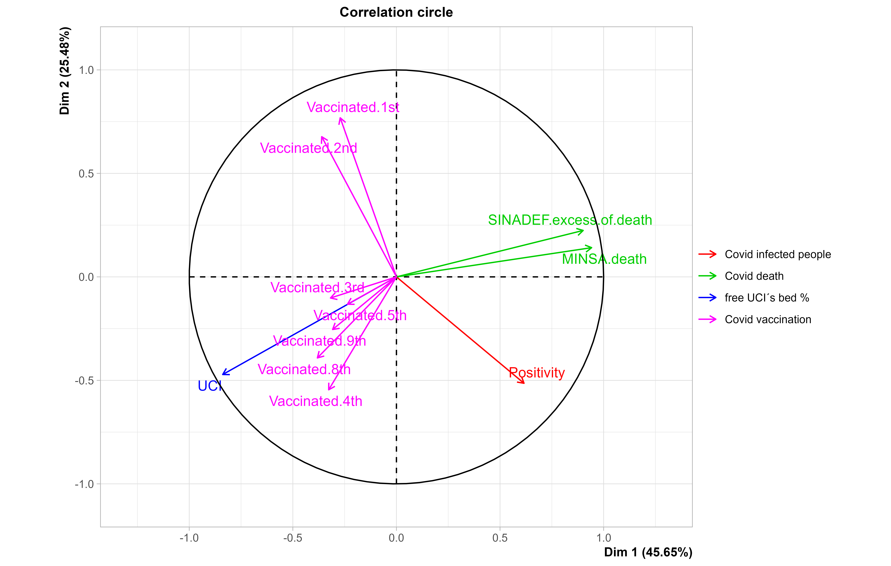

# Multivariate analyze

## Contents
-   [Introduction](#introduction)
-   [Principal outcomes](#principal-outcomes)
-   [Discussion](##discussion)
-   [Conclusions](#conclusions)
-   [R code](#r-code)

## Introduction
After cleaning and sorting the COVID-19 data, it is possible to merge and analyze it to reveal patterns and trends in the spread of COVID-19. the next step is to perform a multivariate analysis, which will help to generate hypotheses about the spread of COVID-19 in the future.

## Principal outcomes
I merged 20 variables, including date, molecular positivity, number of samples for molecular and antigen tests, serological positivity, number of samples for serological tests, excess of SINADEF's deaths, MINSA's deaths, DIRESA+DIRIS's deaths, DIRESA+DIRIS's COVID-19 patients, non-free beds in ICUs, and vaccinated people. These variables were then clustered into four groups based on their affinity: infected people, deaths, available ICU beds (%), and vaccinated people.
                 
### Factorial Principal components (FPCs)
||
|:----------------------------------------------------------------------------:|
|*Figure 1.Analysis factorial of COVID-19:infected people, deaths, free bed(%) and vaccinated people*|

The first principal component, DIM1, which explains approximately 64% of the variance in the data, is interpreted as a signal of the effect of COVID-19 mortality on people in intensive care units (ICUs). DIM1 has the highest loading for variables such as the percentage of free ICU beds, the number of COVID-19 deaths, and the number of COVID-19 infected people. The second principal component, DIM2, which explains approximately 22% of the variance in the data, is interpreted as a signal of the decreasing effect of COVID-19 mortality due to vaccination. DIM2 has the highest loading for variables such as the number of free vaccinated people and the number of COVID-19 deaths.

