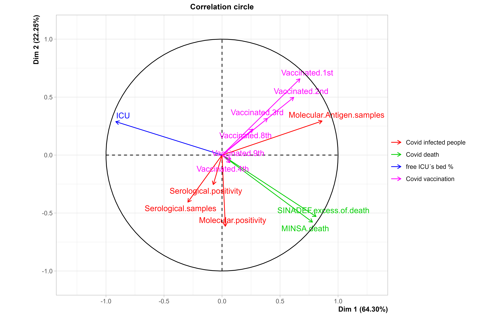

# Multivariate analyze

## Contents
-   [Introduction](#introduction)
-   [Principal outcomes](#principal-outcomes)
-   [Discussion](##discussion)
-   [Conclusions](#conclusions)
-   [R code](#r-code)

## Introduction
After cleaning and sorting the COVID-19 data, it is possible to merge and analyze it to reveal patterns and trends in the spread of COVID-19. the next step is to perform a multivariate analysis, which will help to generate hypotheses about the spread of COVID-19 in the future.

## Principal outcomes
I merged 20 variables (date, Molecular positivity, number of samples  Molecular and Antigen tests, Serological positivity, number of samples  Serological tests, Excess of SINADEF´s deaths, MINSA´s deaths, DIRESA+DIRIS´s deaths, DIRESA+DIRIS´s COVID-19 patients, Non-free bed of ICU, and Vaccination people) were clustered in group according to affinity in 
                 
                
### Factorial Principal components (FPCs)

||
|:----------------------------------------------------------------------------:|
|*Figure 1.Compounded exploratory plot*|