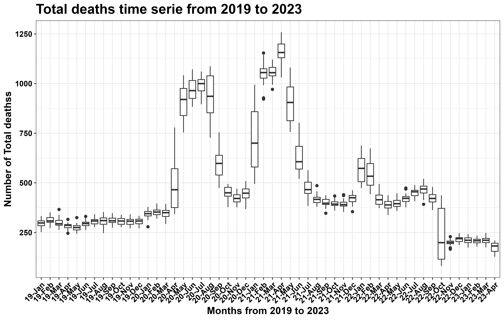
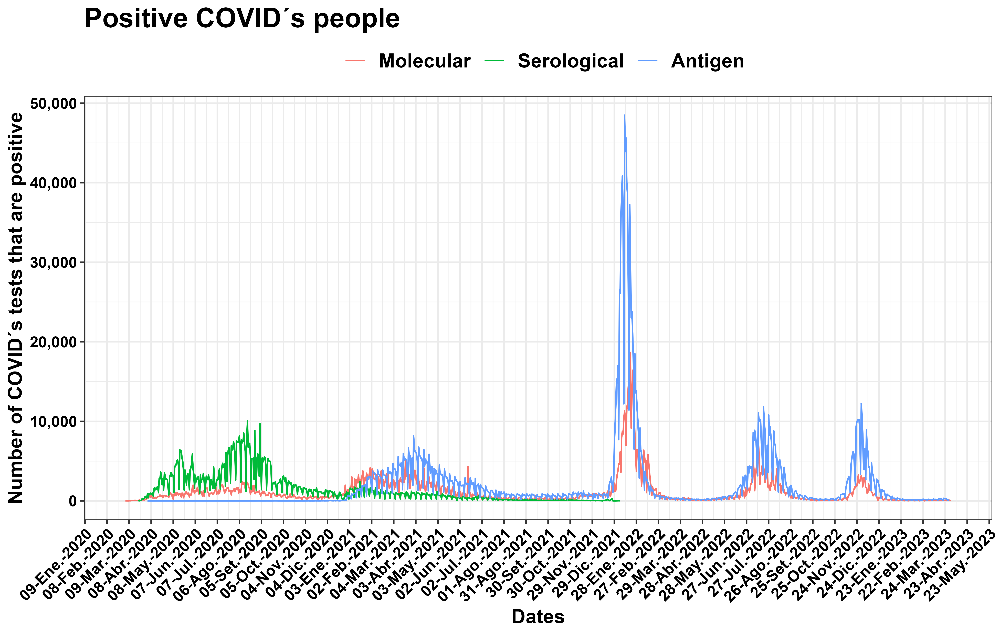
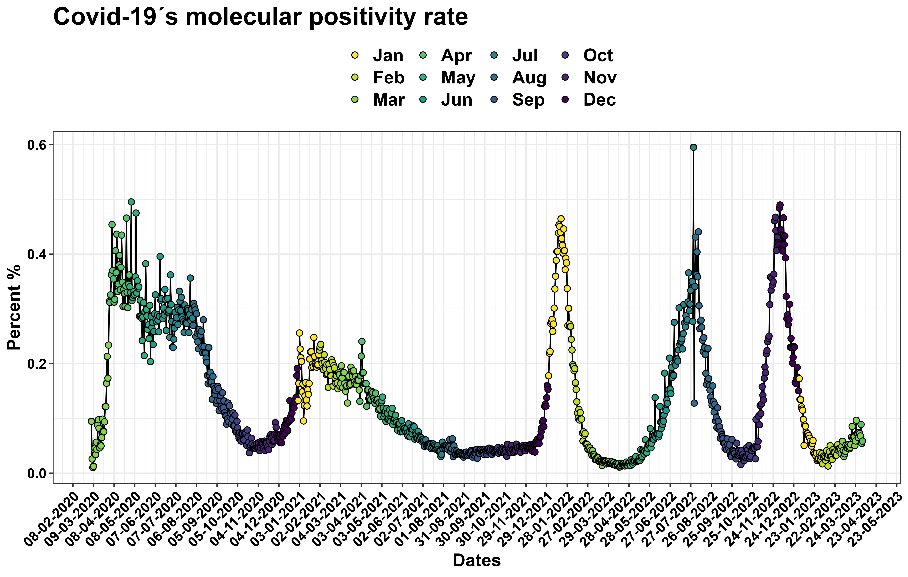
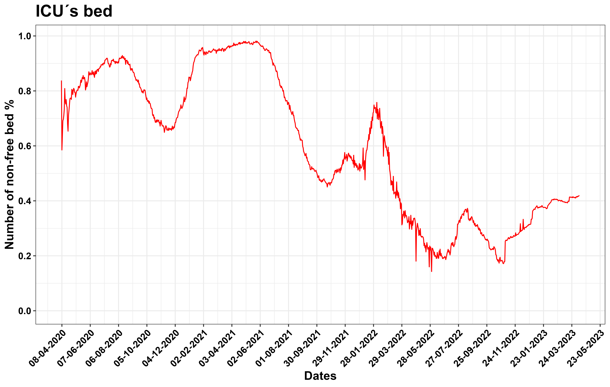

# to clean and sort Covid data-set

## Contents
-   [Introduction](#introduction)
-   [Exploratory plotting](#exploratory-plotting)
-   [Natural mortality](#natural-mortality)
-   [Covid positivity](#covid-positivy)
-   [Covid mortality](#covid-mortality)
-   [Available bed of ICU](#available-bed-of-uci)
-   [Covid vaccination](#covid-vaccination)
-   [Conclusions](#conclusions)
-   [R code](#r-code)

## Introduction
One highlight of scientific research is the process of cleaning and sorting data to identify and resolve any potential issues. Therefore, researchers should invest a significant amount of time inspecting their data for potential errors or inconsistencies. This meticulous approach ensures that the data is reliable and accurate, and helps to avoid any false conclusions or incorrect interpretations. By carefully examining and cleaning the data, researchers can have confidence in their results and ensure that their findings contribute to advancing knowledge in their field.

## Exploratory plotting
First of all, one way to improve the quality of your data is to plot it. By visualizing your data, you can quickly identify any outliers or distorted values that may need to be corrected.

|[](https://github.com/jasb3110/COVIDPERU/blob/f41196ef7096026e2a940d7323583b8b07b9956b/plotting/exploratory.plot.png?raw=true)|
|:----------------------------------------------------------------------------:|
|*Figure 1.Compounded exploratory plot*|

SINADEF's data is compiled as the number of deaths per day which are managed by Peruvian heath ministry. In [(fig. 1)](#exploratory-plotting), there is a noticeable breakpoint on October 12th, 2022 in the SINADEF´s data. It is unclear what caused this change or if there was an issue that was not explained. After identifying the issue with the data, I made an effort to resolve it and remove any discrepancies from the dataset.

## Natural mortality
Natural mortality refers to the number of deaths that occur due to natural causes, such as diseases and age-related conditions, but excludes deaths caused by accidents, homicides, and suicides.

|[](https://github.com/jasb3110/COVIDPERU/blob/59d8989645448d2234cef2782befec6e611299e8/plotting/fallecidos.todos.png?raw=true)|
|:----------------------------------------------------------------------------:|
| *Figure 2. Natural mortality according to SINADEF*|

In [(fig. 2)](#natural-mortality), the number of natural deaths is shown to be clustered by month. It is found that the same abrupt pattern is observed in October 2022 is found to be lower than that all months prior to the COVID-19 pandemic in 2020.

|[](https://github.com/jasb3110/COVIDPERU/blob/59d8989645448d2234cef2782befec6e611299e8/plotting/fallecidos.provincias2.png?raw=true) |
|:----------------------------------------------------------------------------:|
|*Figure 3. Natural mortality per regions*|

Similarly, I plotted the number of natural deaths per region and found an issue in October 2022 that was not consistent across all regions. The issue in October 2022 appears to be more pronounced in certain regions with larger populations (fig. 3).

## Covid positivity
During the COVID-19 pandemic in Peru, the Peruvian government implemented various methods to detect the presence of COVID-19 in people, including different types of biological tests like: Molecular, Antigen and serological test. Each test has its own assumptions and biases that should be taken into account when interpreting the results.

| [](https://github.com/jasb3110/COVIDPERU/blob/59d8989645448d2234cef2782befec6e611299e8/plotting/covid.todo.png?raw=true) |
|:----------------------------------------------------------------------------:|
|*Figure 4. COVID-19 positivity according to type of test*|

The results of molecular, antigen, and serological tests tend to behave similarly. The high and low values seem to describe the increase/decrease of COVID-19 cases in Peru (fig. 4).

|[](https://github.com/jasb3110/COVIDPERU/blob/59d8989645448d2234cef2782befec6e611299e8/plotting/relacion.positivas.positivas+negativas.molecular.png?raw=true) |
|:----------------------------------------------------------------------------:|
|*Figure 5. Covid-19 positivity molecular test in percent*|

In particular, Molecular test revealed better than other tests. Because it is less likely to present false positive or negative results and represents a shorter testing time.

## Covid mortality
Here, I have linked the COVID-19 deaths reported by the Health Ministry (MINSA) with the excess natural deaths reported by SINADEF, which estimates the difference between natural deaths during the COVID-19 pandemic and the average number of natural deaths before the pandemic. I have observed that the gap that appeared on 12th October, 2022 is not present in the COVID-19 deaths data.

| [](https://github.com/jasb3110/COVIDPERU/blob/59d8989645448d2234cef2782befec6e611299e8/plotting/serie.tiempo.fallecidosvsexcesodemuertos2.png?raw=true)|
|:----------------------------------------------------------------------------:|
|*Figure 6. Excess of deaths according to SINADEF and COVID-19 number of death according to MINSA*|

Next, I examined the relationship between COVID-19 deaths and excess natural deaths before October 12th, 2022. Fig. 7 displays the linear model that illustrates the correlation between these two variables. Notably, there is a close relationship between the two, indicating similar patterns of behaviour.

|[](https://github.com/jasb3110/COVIDPERU/blob/59d8989645448d2234cef2782befec6e611299e8/plotting/regresion.png?raw=true) |
|:----------------------------------------------------------------------------:|
|*Figure 7. Linear regression of excess of deaths versus number of COVID-19 deaths which reported by MINSA before to gap on 12th Octuber, 2022*|

## Available bed of ICU

During the COVID-19 pandemic, a large number of deaths likely led to a shortage of intensive care unit beds, which had a detrimental effect on COVID-19 patients."Unidad de Cuidados Intensivos (UCI)" in Spanish, which translates to Intensive Care Unit (ICU) in English.

|[](https://github.com/jasb3110/COVIDPERU/blob/94c2fd6b2429b4f645d293f475734a3b6690e360/plotting/serie.tiempo.UCI2.png?raw=true) |
|:----------------------------------------------------------------------------:|
|*Figure 8. Non-free beds of ICU in percent*|

Fig. 8 shows that the percentage of available ICU´s beds is modulated by increasing/decreasing COVID-19 positivity rates, with high and low signals observed previously.

## COVID-19 vaccination

In the case of COVID-19, vaccination is a process being managed by the Peruvian government to control the spread of the pandemic.

|[](https://github.com/jasb3110/COVIDPERU/blob/94c2fd6b2429b4f645d293f475734a3b6690e360/plotting/serie.tiempo.vacunados2.png?raw=true) |
|:----------------------------------------------------------------------------:|
|*Figure 9. COVID-19 Vaccination in progress in Peru*|

Fig. 9 shows that Peruvian people are not willing to receive or access new doses of vaccination. Stakeholders should take note of this pattern and promote vaccination as a way to prevent future waves of COVID-19 in Peru.

## Conclusion

The COVID-19 data provided to the Peruvian government, including excess deaths, COVID-19 deaths, COVID-19 infections, available ICU beds, and the number of vaccine doses administered, could be improved to show more consistent and similar patterns.

Finally, this data will help to understand the mechanisms of COVID-19 spread at the population level and can be used as input for predictive models.

## R code

Bellow I attached a R-script. [Contact Us](mailto:solisbenites.jose@gmail.com) here, if you consider to give opinions, suggestions and questions.

``` markdown
################################################################################
memory.size(max=99999)
setwd("~/COVID19/")#directory


library("magrittr")
library("plyr")
library("dplyr")
library("janitor")#paquetes que se deben instalar
library("ggplot2")
library("viridis")  
library("scales")
library("stringr")
library("gganimate")
library("transformr")
library("gifski")
library("data.table")
library("pracma")
library("tidyr")
library("bestNormalize")
library("FactoMineR")
library("vegan")
library("vars")
library("forecast")
library("mgcv")
library("mgcViz")
library("itsadug")
library("visreg")
library("gridExtra")
library("magrittr")
library("devtools")
library("gamm4")
library("tidymv")

####
ggplotRegression<- function (fit) {
  
  if(round(fit$coef[[1]],2)==0){
    a=format(fit$coefficients[[1]], scientific = TRUE)
  }else{
    a=round(fit$coef[[1]],2)
  }
  
  if(round(fit$coef[[2]],2)==0){
    b=format(fit$coefficients[[2]], scientific = TRUE)
  }else{
    b=round(fit$coef[[2]],2)
  }
  
  if(round(summary(fit)$coef[2,4],2)==0){
    pv="p < 0.001"
  }else{
    pv="p > 0.001"
  }

  Label=paste0("y = ",a," + ",
               b,"x\n",
               "adj R-squared"," = ",round(summary(fit)$r.squared,3),"\n",
               "  n = ",length(fit$fitted.values),"\n",
              pv)
  
  ggplot(fit$model, aes_string(x = names(fit$model)[2], y = names(fit$model)[1])) + 
    geom_point() +
    stat_smooth(method = "lm",se=TRUE,col="black") +
    scale_x_continuous(limits = c((-.2*abs(min(as.numeric(fit$model[[2]]),na.rm=TRUE))+min(as.numeric(fit$model[[2]]),na.rm=TRUE)),(.2*abs(max(as.numeric(fit$model[[2]]),na.rm=TRUE))+max(as.numeric(fit$model[[2]]),na.rm=TRUE))),labels = scales::comma,breaks =scales::pretty_breaks(n = 5))+
    scale_y_continuous(limits = c((-.2*abs(min(as.numeric(fit$model[[1]]),na.rm=TRUE))+min(as.numeric(fit$model[[1]]),na.rm=TRUE)),(.2*abs(max(as.numeric(fit$model[[1]]),na.rm=TRUE))+max(as.numeric(fit$model[[1]]),na.rm=TRUE))),labels = scales::comma,breaks =scales::pretty_breaks(n = 5))+
    annotate(geom = 'text', x =(.6*abs(min(as.numeric(fit$model[[2]]),na.rm=TRUE))+min(as.numeric(fit$model[[2]]),na.rm=TRUE)), y =(.1*abs(max(as.numeric(fit$model[[1]]),na.rm=TRUE))+max(as.numeric(fit$model[[1]]),na.rm=TRUE)), label =Label, parse=F)+
    theme_bw()
}
####

#Leyendo la data
m=fread("fallecidos_sinadef.csv",sep="|",dec=".",header = TRUE,fill=TRUE)#fallecidos segun SINADEF

#limpiando y ordenando la data de muertos sinadef
m=as.data.frame(m)
#dead=row_to_names(m,row_number = 2, remove_row = TRUE, remove_rows_above = TRUE)
#
dead=m
rownames(dead)=NULL
dead$Nº=NULL
#dead$`TIEMPO EDAD`=NULL
#dead$`COD# UBIGEO DOMICILIO`=NULL
dead$`TIPO SEGURO`=NULL

dead$`TIPO LUGAR`=NULL
dead$INSTITUCION=NULL
dead$NECROPSIA=NULL

dead$dia=as.numeric(format(as.Date(dead$FECHA,format="%Y-%m-%d"), format = "%d"))
dead$meses=as.numeric(format(as.Date(dead$FECHA,format="%Y-%m-%d"), format = "%m"))
dead$años=as.numeric(format(as.Date(dead$FECHA,format="%Y-%m-%d"), format = "%Y"))

dead$EDAD=as.numeric(dead$EDAD)
dead$MES=as.numeric(dead$meses)
dead=as.data.frame(dead)
order=sort(unique(dead$FECHA))
dead$date=rep(NA,length(dead$FECHA))

for(i in 1:length(order)){
  dead$date[which(dead$FECHA==order[i])]=i
}

dead=as.data.frame(dead)
#errores en la data de fechas
#para dias e1|e2|e3 = 0
e1=sum(is.na(dead$dia))
e2=sum(which(dead$dia>31))
e3=sum(which(dead$dia<1))
e1
e2
e3
#para meses
#para dias e4|e5|e6 = 0
e4=sum(is.na(dead$meses))
e5=sum(which(dead$meses>12))
e6=sum(which(dead$meses<1))
e4
e5
e6
#para años
#para dias e7|e8|e9 = 0
e7=sum(is.na(dead$años))
e8=sum(which(dead$años>2022))
e9=sum(which(dead$años<2017))
e7
e8
e9

MM=unique(dead$`MUERTE VIOLENTA`)
tt=dead[which(dead$`MUERTE VIOLENTA`==MM[1]|dead$`MUERTE VIOLENTA`==MM[2]|dead$`MUERTE VIOLENTA`==MM[3]|dead$`MUERTE VIOLENTA`==MM[9]),]

#Limpiando errores
#se asume que hay un solo error por columna de datos

TT=unique(tt$`TIEMPO EDAD`)
EC=unique(tt$`ESTADO CIVIL`)
NI=unique(tt$`NIVEL DE INSTRUCCIÓN`)

me=c(which(tt$`ESTADO CIVIL`==EC[2]&tt$EDAD>17),
     which(tt$`ESTADO CIVIL`==EC[4]&tt$EDAD>17),
     which(tt$`ESTADO CIVIL`==EC[7]&tt$EDAD>17),
     which(tt$`ESTADO CIVIL`==EC[8]&tt$EDAD>17),
     which(tt$`ESTADO CIVIL`==EC[9]&tt$EDAD>17))

mi=c(which(tt$`NIVEL DE INSTRUCCIÓN`==NI[1]&tt$EDAD>12),
     which(tt$`NIVEL DE INSTRUCCIÓN`==NI[2]&tt$EDAD>6),
     which(tt$`NIVEL DE INSTRUCCIÓN`==NI[4]&tt$EDAD>12),
     which(tt$`NIVEL DE INSTRUCCIÓN`==NI[5]&tt$EDAD>16),
     which(tt$`NIVEL DE INSTRUCCIÓN`==NI[6]&tt$EDAD>21),
     which(tt$`NIVEL DE INSTRUCCIÓN`==NI[8]&tt$EDAD>12),
     which(tt$`NIVEL DE INSTRUCCIÓN`==NI[9]&tt$EDAD>18),
     which(tt$`NIVEL DE INSTRUCCIÓN`==NI[10]&tt$EDAD>18))

#Segundos
m1=which(tt$EDAD[which(tt$`TIEMPO EDAD`==TT[7])]>60)
tt$`TIEMPO EDAD`[intersect(m1,me)]=TT[1]
tt$`TIEMPO EDAD`[intersect(m1,mi)]=TT[1]
ss1=which(tt$`TIEMPO EDAD`==TT[7])
tt$EDAD[ss1]=tt$EDAD[ss1]/(60*60*24*365)

#minutos
m2=which(tt$EDAD[which(tt$`TIEMPO EDAD`==TT[2])]>60)
tt$`TIEMPO EDAD`[intersect(m2,me)]=TT[1]
tt$`TIEMPO EDAD`[intersect(m2,mi)]=TT[1]
ss2=which(tt$`TIEMPO EDAD`==TT[2])
tt$EDAD[ss2]=tt$EDAD[ss2]/(60*24*365)
#HORAS
m3=which(tt$EDAD[which(tt$`TIEMPO EDAD`==TT[6])]>24)
tt$`TIEMPO EDAD`[intersect(m3,me)]=TT[1]
tt$`TIEMPO EDAD`[intersect(m3,mi)]=TT[1]
ss3=which(tt$`TIEMPO EDAD`==TT[5])
tt$EDAD[ss3]=tt$EDAD[ss3]/(24*365)  
#dias
m4=which(tt$EDAD[which(tt$`TIEMPO EDAD`==TT[5])]>31)
tt$`TIEMPO EDAD`[intersect(m4,me)]=TT[1]
tt$`TIEMPO EDAD`[intersect(m4,mi)]=TT[1]
ss4=which(tt$`TIEMPO EDAD`==TT[4])
tt$EDAD[ss4]=tt$EDAD[ss4]/(365) 
#MESES
m5=which(tt$EDAD[which(tt$`TIEMPO EDAD`==TT[3])]>12)
tt$`TIEMPO EDAD`[intersect(m5,me)]=TT[1]
tt$`TIEMPO EDAD`[intersect(m5,mi)]=TT[1]
ss4=which(tt$`TIEMPO EDAD`==TT[3])
tt$EDAD[ss4]=tt$EDAD[ss4]/(12) 
#AñOS
m6=which(tt$EDAD[which(tt$`TIEMPO EDAD`==TT[1])]>123)
tt$EDAD[m6]=NA

#ignorados y sin registro
m7=c(which(tt$`TIEMPO EDAD`==TT[1]|tt$`TIEMPO EDAD`==TT[3]|tt$`TIEMPO EDAD`==TT[6]|tt$`TIEMPO EDAD`==TT[7]))
tt$`TIEMPO EDAD`[which(tt$EDAD[m7]>60)]=TT[2]
tt$EDAD[which(tt$EDAD[m7]<60)]=NA

tt$EDAD=as.numeric(tt$EDAD)
tt$EDAD[which(tt$EDAD>=123)]=NA

#ordenando por sexos y edades
sinsexo=tt
sinsexo$SEXO=NULL

sinsexo$EDAD=trunc(sinsexo$EDAD*100)/100

todo=as.data.frame(sinsexo%>%count(date,dia,meses,años,EDAD))

y1=tt[which(tt$SEXO=="FEMENINO"),]
y1$SEXO=NULL
y1$EDAD=trunc(y1$EDAD*100)/100

muj=as.data.frame(y1%>%count(date,dia,meses,años,EDAD))

y2=tt[which(tt$SEXO=="MASCULINO"),]
y2$SEXO=NULL
y2$EDAD=trunc(y2$EDAD*100)/100
hom=as.data.frame(y2%>%count(date,dia,meses,años,EDAD))

mujeres=as.data.frame(y1%>%count(date,dia,meses,años))
mujeres$fechas=paste(mujeres$dia,"-",mujeres$meses,"-",mujeres$años)

hombres=as.data.frame(y2%>%count(date,dia,meses,años))
hombres$fechas=paste(hombres$dia,"-",hombres$meses,"-",hombres$años)

todos=as.data.frame(sinsexo%>%count(date,dia,meses,años))
todos$fechas=as.Date(paste0(todos$dia,"-",todos$meses,"-",todos$años),format="%d-%m-%Y")

#plot exploratory
png("exploratory.plot.png", width = 500, height = 318, units = 'mm', res =1200)

plot.new();par(mfrow = c(4, 2))
plot(mujeres$date,mujeres$n,type="l",ylab="Number of deaths",xlab=paste0("Days from ",mujeres$fechas[min(mujeres$date)]," to ",mujeres$fechas[max(mujeres$date)]),main = "Number of Women deaths")
plot(hombres$date,hombres$n,type="l",ylab="Number of deaths",xlab=paste0("Days from ",hombres$fechas[min(hombres$date)]," to ",hombres$fechas[max(hombres$date)]),main = "Number of men deaths")
plot(todos$date,todos$n,type="l",ylab="Number of deaths",xlab=paste0("Days from  ",todos$fechas[min(todos$date)]," to ",todos$fechas[max(todos$date)]),main = "Number of total deathss")
plot(todos$date,todos$n,type="l",col="gray50",ylab="Number of deathss",xlab=paste0("Days from ",todos$fechas[min(todos$date)]," to ",todos$fechas[max(todos$date)]),main = "Number of total deaths")
points(mujeres$date,mujeres$n,type="l",col="blue",ylab="Number of deaths",xlab=paste0("Days from ",mujeres$fechas[min(mujeres$date)]," to ",mujeres$fechas[max(mujeres$date)]),main = "Number of total deaths")
points(hombres$date,hombres$n,type="l",col="red",ylab="Number of deaths",xlab=paste0("Days from ",hombres$fechas[min(hombres$date)]," to ",hombres$fechas[max(hombres$date)]),main = "Number of total deaths")

interval=signif(log10(length(todo$EDAD))*3.3+1,)
k=seq(from=0,to=150,by=interval)

hist(na.contiguous(todo$EDAD),breaks = c(k),freq = FALSE,density =10,xlab=paste0("Age´s range each ",interval," years"),main = "Histogram of total deaths")
d1=density(x = na.contiguous(todo$EDAD))
points(d1,col=2,type="l",lwd=2)

interval=signif(log10(length(hom$EDAD))*3.3+1,)
k=seq(from=0,to=150,by=interval)

hist(na.contiguous(hom$EDAD),breaks = c(k),freq = FALSE,density =15,xlab=paste0("Age´s range each ",interval," years"),main = "Histogram of total men´s deaths")
d2=density(x = na.contiguous(hom$EDAD))
points(d2,col=2,type="l",lwd=2)

interval=signif(log10(length(muj$EDAD))*3.3+1,)
k=seq(from=0,to=150,by=interval)

hist(na.contiguous(muj$EDAD),breaks = c(k),freq = FALSE,density =20,xlab=paste0("Age´s range each ",interval," years"),main = "Histogram of total women´s deaths")
d3=density(x =na.contiguous(muj$EDAD))
points(d3,col=2,type="l",lwd=2)

plot(d1, col="blue",lwd=4,main="deaths density",ylim=c(0,max(cbind(d1$y,d2$y,d3$y))))
points(d2, col="red", type="l",lwd=4)
points(d3, col="gray70", type="l",lwd=4)
dev.off()

##############################################################################################################################################################################################33
# Natural mortality during COVID19 

"04 - 3 - 2020" #fecha inicio
todos=todos[which(todos$años>=2019),]
ini=which(todos$dia==04&todos$meses==3&todos$años==2020)
fin=length(todos$fechas)

#Antes del covid
iii=which(todos$dia==02&todos$meses==2&todos$años==2020)#02 - 2 - 2020 fecha inicio
fff=which(todos$dia==03&todos$meses==3&todos$años==2020)#03 - 3 - 2020" fecha inicio

fff-iii#promedio de los muertos 30 dias antes del covid
media=mean(todos$n[iii:fff])
std=sd(todos$n[iii:fff])
100*std/media#coeficiente e variacion

#before Covid period
iii=which(todos$dia==02&todos$meses==2&todos$años==2020)#02 - 2 - 2020 
fff=which(todos$dia==03&todos$meses==3&todos$años==2020)#03 - 3 - 2020

fff-iii#average of people dying in thirty days before to Covid pandemic
media=mean(todos$n[iii:fff])
std=sd(todos$n[iii:fff])
100*std/media#Variation coeficient 

write.csv(cbind(media,std),"exceso.csv",sep=",",dec=".",col.names=TRUE)

#Natural mortality substrate death average before Covid pandemic (before to 30 days)

m_encovid_medio=(todos$n[ini:fin]-media)/std
m_encovid_medio=m_encovid_medio+min(m_encovid_medio)*-1
m_encovid_min=(todos$n[ini:fin]-media-std*1.96)/std
m_encovid_min=m_encovid_min+min(m_encovid_min)*-1
m_encovid_max=(todos$n[ini:fin]-media+std*1.96)/std
m_encovid_max=m_encovid_max+min(m_encovid_max)*-1

encovid=as.data.frame(cbind(as.Date(todos$fechas[ini:fin],format="%Y-%m-%d"),todos$dia[ini:fin],todos$meses[ini:fin],todos$años[ini:fin],m_encovid_medio,m_encovid_min,m_encovid_max))
colnames(encovid)=c("fechas","dia","mes","año","m_encovid_medio","m_encovid_min","m_encovid_max") 

# for intervale each month

mes.abb=c("Ja","Fe","Ma","Ap","My","Jn","Jl","Au","Se","Oc","No","De")
names.mes=paste0(c(rep(19,12),rep(20,12),rep(21,12),rep(22,12),rep(23,12)),"-",month.abb)# desde 2019

###Women
mujeres$nombre.mes=NULL
for(i in 1:length(mujeres$date)){
  mujeres$nombre.mes[i]=month.abb[mujeres$meses[i]]
}  

mujeres$mes.año=paste0(as.numeric(mujeres$años)-2000,"-",mujeres$nombre.mes)
mujeres$mes.año=factor(mujeres$mes.año , levels=c(names.mes))

mujeres$monthYear = paste0((as.numeric(mujeres$años)-2000)+trunc((mujeres$meses-0.5)*100/12)/100)
mujeres=mujeres[mujeres$años>=2019,]
fall.muj=ggplot(data = mujeres, aes(x=mujeres$mes.año, y=mujeres$n)) + geom_boxplot()+labs(title="Women´s deaths time serie from 2019 to 2023",
                                                                                           x ="Months from 2019 to 2023", 
                                                                                           y = "Number of women´s deaths")+
  theme_bw()+
  theme(axis.text.x=element_text(size=11,colour = "black",face="bold",angle=45, hjust=1),axis.text.y=element_text(size=11,colour = "black",face="bold",hjust=1),
        axis.title=element_text(size=14,face="bold"),title = element_text(size=16,colour = "black",face="bold"))

ggsave("fallecidos.mujeres.png", dpi = 600,   width = 250,
       height = 159,unit="mm",plot = fall.muj)

###Men
hombres$nombre.mes=NULL
for(i in 1:length(hombres$date)){
  hombres$nombre.mes[i]=month.abb[hombres$meses[i]]
}  

hombres$mes.año=paste0(as.numeric(hombres$años)-2000,"-",hombres$nombre.mes)
hombres$mes.año=factor(hombres$mes.año , levels=c(names.mes))

hombres$monthYear = paste0((as.numeric(hombres$años)-2000)+trunc((hombres$meses-0.5)*100/12)/100)
hombres=hombres[hombres$años>=2019,]
fall.hom=ggplot(data = hombres, aes(x=hombres$mes.año, y=hombres$n)) + geom_boxplot()+labs(title="Men´s deaths time serie from 2019 to 2023",
                                                                                           x ="Months from 2019 to 2023", 
                                                                                           y = "Number of Men´s deaths")+
  theme_bw()+
  theme(axis.text.x=element_text(size=11,colour = "black",face="bold",angle=45, hjust=1),axis.text.y=element_text(size=11,colour = "black",face="bold",hjust=1),
        axis.title=element_text(size=14,face="bold"),title = element_text(size=16,colour = "black",face="bold"))

ggsave("fallecidos.hombres.png", dpi = 600,   width = 250,
       height = 159,unit="mm",plot = fall.hom)

###All
todos$nombre.mes=NULL
for(i in 1:length(todos$date)){
  todos$nombre.mes[i]=month.abb[todos$meses[i]]
}  

todos$mes.año=paste0(as.numeric(todos$años)-2000,"-",todos$nombre.mes)
todos$mes.año=factor(todos$mes.año , levels=c(names.mes))

todos$monthYear = paste0((as.numeric(todos$años)-2000)+trunc((todos$meses-0.5)*100/12)/100)
todos=todos[todos$años>=2019,]

fall.todos=ggplot(data = todos, aes(x=todos$mes.año, y=todos$n)) + geom_boxplot()+labs(title="Total deaths time serie from 2019 to 2023",
                                                                                       x ="Months from 2019 to 2023", 
                                                                                       y = "Number of Total deathss")+
  theme_bw()+
  theme(axis.text.x=element_text(size=11,colour = "black",face="bold",angle=45, hjust=1),axis.text.y=element_text(size=11,colour = "black",face="bold",hjust=1),
        axis.title=element_text(size=14,face="bold"),title = element_text(size=16,colour = "black",face="bold"))

ggsave("fallecidos.todos.png", dpi = 600,   width = 250,
       height = 159,unit="mm",plot = fall.todos)

####################################################################################################################################################################################
#Sinadef
sinadef=fread("SINADEF - Data.csv",sep=",",dec=".",header=TRUE,fill=TRUE)#fallecidos segun SINADEF
ub=fread("TB_UBIGEOS.csv",sep=",",dec=".",header=TRUE,fill=TRUE)#ubigeos reales

ubi=as.data.frame(ub)

ubi$dep=trunc(ubi$ubigeo_reniec/100)

sinadef=as.data.frame(sinadef[,1:29])
colnames(sinadef)[29]="Perú"
fechas1=sinadef$DATE[1:366]
fechas1.1=paste0(fechas1,"-","2020")
fechas1.1=as.Date(fechas1.1,format="%d-%m-%Y")

fechas2=sinadef$DATE[367:731]
fechas2.1=paste0(fechas2,"-","2021")
fechas3=sinadef$DATE[732:length(sinadef$DATE)]
fechas3.1=paste0(fechas3,"-","2022")
fechas2.1=as.Date(fechas2.1,format="%d-%m-%Y")
fechas3.1=as.Date(fechas3.1,format="%d-%m-%Y")

sinadef$fecha=as.Date(c(fechas1.1,fechas2.1,fechas3.1),format="%Y-%m-%d")
sinadef$DATE=sinadef$fecha
sinadef$fecha=NULL

n.pro=c("DATE","Perú","AMAZONAS","ANCASH","APURIMAC",     
        "AREQUIPA","AYACUCHO","CAJAMARCA",    
        "CALLAO","CUSCO","EXTRANJERO",   
        "HUANCAVELICA","HUANUCO","ICA",          
        "JUNIN","LA LIBERTAD","LAMBAYEQUE",   
        "LIMA","LORETO","MADRE DE DIOS",
        "MOQUEGUA","PASCO","PIURA",        
        "PUNO","SAN MARTIN","SIN REGISTRO", 
        "TACNA","TUMBES","UCAYALI")

ubigeo=unique(sinsexo$`COD# UBIGEO DOMICILIO`)

depp=unique(sinsexo$`DEPARTAMENTO DOMICILIO`)

vector=depp
for( i in 3:length(n.pro)){
  vector[which(vector==n.pro[i])]=i
  vector=na.omit(vector)  
}

depp[c(1:25,27,29:32)]

Vec=c(1:25,27,29:32)

vdepp=1:length(depp)
nn.ex=depp[vdepp[!vdepp %in% Vec]]
sinsexo$Dep=sinsexo$`DEPARTAMENTO DOMICILIO`

sinsexo$`DEPARTAMENTO DOMICILIO`[which(sinsexo$`DEPARTAMENTO DOMICILIO`=="     ")]="SIN REGISTRO" 
sinsexo$`DEPARTAMENTO DOMICILIO`[which(sinsexo$`DEPARTAMENTO DOMICILIO`=="")]="SIN REGISTRO"
sinsexo$`DEPARTAMENTO DOMICILIO`[which(sinsexo$`DEPARTAMENTO DOMICILIO`=="[NO DEFINIDO]")]="SIN REGISTRO"
sinsexo$`DEPARTAMENTO DOMICILIO`[which(sinsexo$`DEPARTAMENTO DOMICILIO`=="     ")]="SIN REGISTRO" 

for(i in 1:length(sinsexo$`DEPARTAMENTO DOMICILIO`)){
  if (sum(nn.ex==sinsexo$`DEPARTAMENTO DOMICILIO`[i])==0){
    next()
  }else{
    if (sum(which(nn.ex==sinsexo$`DEPARTAMENTO DOMICILIO`[i]))<4){  
      sinsexo$Dep[i]="SIN REGISTRO"
    }else{
      sinsexo$Dep[i]="EXTRANJERO"  
    }
  }
}

prov.sinadef=as.data.frame(sinsexo%>%count(FECHA,Dep))
unique(prov.sinadef$Dep)
prov.sinadef$Dep[which(prov.sinadef$Dep=="     ")]="SIN REGISTRO"
prov.sinadef$Dep[which(prov.sinadef$Dep=="")]="SIN REGISTRO"
prov.sinadef$Dep[which(prov.sinadef$Dep=="[NO DEFINIDO]")]="SIN REGISTRO"
####################################
m.plot=sinadef%>%gather(variable,value,-DATE)

m.plot$variable=factor(m.plot$variable,levels=c("Perú","AMAZONAS","ANCASH","APURIMAC",     
                                                "AREQUIPA","AYACUCHO","CAJAMARCA",    
                                                "CALLAO","CUSCO","EXTRANJERO",   
                                                "HUANCAVELICA","HUANUCO","ICA",          
                                                "JUNIN","LA LIBERTAD","LAMBAYEQUE",   
                                                "LIMA","LORETO","MADRE DE DIOS",
                                                "MOQUEGUA","PASCO","PIURA",        
                                                "PUNO","SAN MARTIN","SIN REGISTRO", 
                                                "TACNA","TUMBES","UCAYALI"))

provincias=as.data.frame(m.plot[which(m.plot$variable!="SIN REGISTRO"&m.plot$variable!="EXTRANJERO"),])

pro.plot=provincias%>%
  ggplot(aes(x=DATE,y=value,color=variable))+geom_line(lwd=0.2)+
  facet_wrap(~variable,scales="free_y",ncol=7)+ylab("Number of deaths")+xlab("Dates for each regions")+scale_x_date(date_breaks = "120 days",date_labels = "%d-%m-%Y")+
  guides(color=FALSE)+theme_bw()+
  theme(axis.text.x=element_text(size=10,colour = "black",face="bold",angle=45, hjust=1),axis.text.y=element_text(size=20,colour = "black",face="bold",hjust=1),
        axis.title=element_text(size=20,face="bold"),title = element_text(size=16,colour = "black",face="bold"))

ggsave("fallecidos.provincias.png", dpi = 1200,   width = 500,
       height = 268,unit="mm",plot = pro.plot)

##################
m.plot2=prov.sinadef

colnames(m.plot2)=colnames(m.plot)

m.plot2$variable[which(m.plot2$variable=="[NO DEFINIDO]")]="SIN REGISTRO"
m.plot2$variable[which(m.plot2$variable=="")]="SIN REGISTRO"
m.plot2$variable[which(m.plot2$variable=="     ")]="SIN REGISTRO"

m.plot2$variable=factor(m.plot2$variable,levels=unique(prov.sinadef$Dep))

provincias2=as.data.frame(m.plot2[which(m.plot2$variable!="SIN REGISTRO"&m.plot2$variable!="EXTRANJERO"),])
#provincias2=as.data.frame(m.plot2)

provincias3=provincias2[min(which(provincias2$DATE=="2020-03-01")):length(provincias2$DATE),]

pro.plot2=provincias3%>%
  ggplot(aes(x=DATE,y=value,color=variable))+geom_line(lwd=0.2)+
  facet_wrap(~variable,scales="free_y",ncol=7)+ylab("Number of deaths")+xlab("Dates for each regions")+scale_x_date(date_breaks = "120 days",date_labels = "%d-%m-%Y")+
  guides(color=FALSE)+theme_bw()+
  scale_y_continuous(breaks =scales::pretty_breaks(n = 4))+
  theme(axis.text.x=element_text(size=10,colour = "black",face="bold",angle=45, hjust=1),axis.text.y=element_text(size=20,colour = "black",face="bold",hjust=1),
        axis.title=element_text(size=20,face="bold"),title = element_text(size=16,colour = "black",face="bold"))

ggsave("fallecidos.provincias2.png", dpi = 1200,   width = 500,
       height = 268,unit="mm",plot = pro.plot2)

################################################################
#To clean and sort of Covid´s data
covid=fread("positivos_covid.csv",sep=";",dec=".",header=TRUE,fill=TRUE)#People with Covid diagnosis

covid$id_persona=NULL
covid$FECHA_RESULTADO=as.character(covid$FECHA_RESULTADO)
covid$FECHA_RESULTADO=as.Date(covid$FECHA_RESULTADO,format ="%Y%m%d")

covid$dia=as.numeric(format(as.Date(covid$FECHA_RESULTADO,format="%Y-%m-%d"), format = "%d"))
covid$meses=as.numeric(format(as.Date(covid$FECHA_RESULTADO,format="%Y-%m-%d"), format = "%m"))
covid$años=as.numeric(format(as.Date(covid$FECHA_RESULTADO,format="%Y-%m-%d"), format = "%Y"))

order1=sort(unique(covid$FECHA_RESULTADO))
covid$date=rep(NA,length(covid$FECHA_RESULTADO))

for(i in 1:length(order1)){
  covid$date[which(covid$FECHA_RESULTADO==order1[i])]=i
}

covid2=data.frame(covid$date,covid$dia,covid$meses,covid$años,covid$METODODX,covid$SEXO)

covid3=as.data.frame(na.omit(covid2))

colnames(covid3)=c("date","dia","meses","años","METODODX","SEXO")

covid3$METODODX=factor(covid3$METODODX,levels=unique(covid3$METODODX))
covid3$SEXO=factor(covid3$SEXO,levels=unique(covid3$SEXO))

covid3$fecha=as.Date(paste0(covid3$años,"-",covid3$meses,"-",covid3$dia),format="%Y-%m-%d")
covid19=as.data.frame(covid3%>%count(date,dia,meses,años,METODODX,SEXO,fecha))

#delay days for each tests
desfase_PCR=2#dias que hay que que restar PCR
desfase_PR=8#dias que hay que restar Prueba rapida
desfase_PA=5#dias que hay que restar Prueba antigenica

covid19$FECHA=rep(NA,length(covid19$fecha))
covid19$FECHA[which(covid19$METODODX=="PCR")]=as.character(covid19$fecha[which(covid19$METODODX=="PCR")]-desfase_PCR)
covid19$FECHA[which(covid19$METODODX=="PR")]=as.character(covid19$fecha[which(covid19$METODODX=="PR")]-desfase_PR)
covid19$FECHA[which(covid19$METODODX=="AG")]=as.character(covid19$fecha[which(covid19$METODODX=="AG")]-desfase_PA)
covid19$FECHA=as.Date(covid19$FECHA,format="%Y-%m-%d")

covid4=covid3
covid4$SEXO=NULL
covid19r=as.data.frame(covid4%>%count(date,dia,meses,años,METODODX,fecha))

covid19r$FECHA=rep(NA,length(covid19r$fecha))
covid19r$FECHA[which(covid19r$METODODX=="PCR")]=as.character(covid19r$fecha[which(covid19r$METODODX=="PCR")]-desfase_PCR)
covid19r$FECHA[which(covid19r$METODODX=="PR")]=as.character(covid19r$fecha[which(covid19r$METODODX=="PR")]-desfase_PR)
covid19r$FECHA[which(covid19r$METODODX=="AG")]=as.character(covid19r$fecha[which(covid19r$METODODX=="AG")]-desfase_PA)
covid19r$FECHA=as.Date(covid19r$FECHA,format="%Y-%m-%d")

sinsexocovid=covid19r
covidmuj=covid19[covid19$SEXO=="FEMENINO",]
covidmuj$SEXO=NULL
covidhom=covid19[covid19$SEXO=="MASCULINO",]
covidhom$SEXO=NULL

#All country

covidhom$FECHA=as.Date(covidhom$FECHA,format="%Y-%m-%d")
covidmuj$FECHA=as.Date(covidmuj$FECHA,format="%Y-%m-%d")
sinsexocovid$FECHA=as.Date(sinsexocovid$FECHA,format="%Y-%m-%d")

covidhom$METODODX=as.character(covidhom$METODODX)
covidmuj$METODODX=as.character(covidmuj$METODODX)
sinsexocovid$METODODX=as.character(sinsexocovid$METODODX)

covidhom$METODODX[which(covidhom$METODODX=="PCR")]="Molecular"
covidhom$METODODX[which(covidhom$METODODX=="PR")]="Serological"
covidhom$METODODX[which(covidhom$METODODX=="AG")]="Antigen"

covidmuj$METODODX[which(covidmuj$METODODX=="PCR")]="Molecular"
covidmuj$METODODX[which(covidmuj$METODODX=="PR")]="Serological"
covidmuj$METODODX[which(covidmuj$METODODX=="AG")]="Antigen"

sinsexocovid$METODODX[which(sinsexocovid$METODODX=="PCR")]="Molecular"
sinsexocovid$METODODX[which(sinsexocovid$METODODX=="PR")]="Serological"
sinsexocovid$METODODX[which(sinsexocovid$METODODX=="AG")]="Antigen"

covidhom$METODODX=factor(covidhom$METODODX,levels=unique(covidhom$METODODX))
covidmuj$METODODX=factor(covidmuj$METODODX,levels=unique(covidmuj$METODODX))
sinsexocovid$METODODX=factor(sinsexocovid$METODODX,levels=unique(sinsexocovid$METODODX))

# Men
covid.hom=ggplot(data=covidhom, aes(x=covidhom$FECHA, y=covidhom$n, group=covidhom$METODODX))+
  scale_x_date(date_breaks = "30 days",date_labels = "%d-%b-%Y")+
  scale_y_continuous(limits = c(0,max(covidhom$n)), labels = scales::comma,breaks =scales::pretty_breaks(n = 5))+
  geom_line(aes(colour=covidhom$METODODX))+
  theme(legend.position="top")+
  labs(colour="",title="Positive COVID´s men",
       x ="Dates", 
       y = "Number of COVID´s tests that are positive")+
  theme_bw()+
  theme(legend.position="top",legend.text = element_text(color = "black", size = 14,face="bold"), axis.text.x=element_text(size=11,colour = "black",face="bold",angle=45, hjust=1),axis.text.y=element_text(size=11,colour = "black",face="bold",hjust=1),
        axis.title=element_text(size=14,face="bold"),title = element_text(size=16,colour = "black",face="bold"))

ggsave("covid.hombres.png", dpi = 600,   width = 250,
       height = 159,unit="mm",plot = covid.hom)

#Women

covid.muj=ggplot(data=covidmuj, aes(x=covidmuj$FECHA, y=covidmuj$n, group=covidmuj$METODODX))+
  scale_x_date(date_breaks = "30 days",date_labels = "%d-%b-%Y")+
  scale_y_continuous(limits = c(0,max(covidmuj$n)), labels = scales::comma,breaks =scales::pretty_breaks(n = 5))+
  geom_line(aes(color=covidmuj$METODODX))+
  theme(legend.position="top")+
  labs(colour="",title="Positive COVID´s women",
       x ="Dates", 
       y = "Number of COVID´s tests that are positive")+
  theme_bw()+
  theme(legend.position="top",legend.text = element_text(color = "black", size = 14,face="bold"), axis.text.x=element_text(size=11,colour = "black",face="bold",angle=45, hjust=1),axis.text.y=element_text(size=11,colour = "black",face="bold",hjust=1),
        axis.title=element_text(size=14,face="bold"),title = element_text(size=16,colour = "black",face="bold"))

ggsave("covid.mujeres.png", dpi = 600,   width = 250,
       height = 159,unit="mm",plot = covid.muj)

# All
covid.todo=ggplot(data=sinsexocovid, aes(x=sinsexocovid$FECHA, y=sinsexocovid$n, group=sinsexocovid$METODODX))+
  scale_x_date(date_breaks = "30 days",date_labels = "%d-%b-%Y")+
  scale_y_continuous(limits = c(0,max(sinsexocovid$n)), labels = scales::comma,breaks =scales::pretty_breaks(n = 5))+
  geom_line(aes(color=sinsexocovid$METODODX))+
  labs(colour="",title="Positive COVID´s people",
       x ="Dates", 
       y = "Number of COVID´s tests that are positive")+
  theme_bw()+
  theme(legend.position="top",legend.text = element_text(color = "black", size = 14,face="bold"), axis.text.x=element_text(size=11,colour = "black",face="bold",angle=45, hjust=1),axis.text.y=element_text(size=11,colour = "black",face="bold",hjust=1),
        axis.title=element_text(size=14,face="bold"),title = element_text(size=16,colour = "black",face="bold"))

ggsave("covid.todo.png", dpi = 600,   width = 250,
       height = 159,unit="mm",plot = covid.todo)

################################################################################
#Covid mortality
mcovid=fread("fallecidos_covid.csv",sep=";",dec=".",header=TRUE,fill=TRUE)

#to find Nas
mm1=sum(is.na(mcovid$FECHA_FALLECIMIENTO))
mm2=sum(is.na(mcovid$EDAD_DECLARADA))
mm3=sum(is.na(mcovid$SEXO))
mm4=sum(is.na(mcovid$FECHA_NAC))#falta datos de fechas nacimientos
mm5=sum(is.na(mcovid$DEPARTAMENTO))
mm6=sum(is.na(mcovid$PROVINCIA))
mm7=sum(is.na(mcovid$DISTRITO))
mm1
mm2
mm3
mm4
mm5
mm6
mm7

mm8=sum(mcovid$FECHA_FALLECIMIENTO=="")
mm9=sum(mcovid$EDAD_DECLARADA=="")
mm10=sum(mcovid$SEXO=="")
mm11=sum(mcovid$FECHA_NAC=="")#falta datos
mm12=sum(mcovid$DEPARTAMENTO=="")
mm13=sum(mcovid$PROVINCIA=="")#falta datos
mm14=sum(mcovid$DISTRITO=="")#falta datos
mm8
mm9
mm10
mm11
mm12
mm13#falta de datos de provincia
mm14#falta de datos de distritos

mcovid$FECHA_FALLECIMIENTO=as.character(mcovid$FECHA_FALLECIMIENTO)
mcovid$dia=as.numeric(format(as.Date(mcovid$FECHA_FALLECIMIENTO,format="%Y%m%d"), format = "%d"))
mcovid$meses=as.numeric(format(as.Date(mcovid$FECHA_FALLECIMIENTO,format="%Y%m%d"), format = "%m"))
mcovid$años=as.numeric(format(as.Date(mcovid$FECHA_FALLECIMIENTO,format="%Y%m%d"), format = "%Y"))

mcovid$fechas=paste0(mcovid$años,"-",mcovid$meses,"-",mcovid$dia)
mcovid$fechas2=paste0(mcovid$dia,"-",mcovid$meses,"-",mcovid$años)
mcovid$EDAD_DECLARADA=as.numeric(mcovid$EDAD_DECLARADA)
covid=as.data.frame(mcovid)

#tabla de contigencia sin datos perdidos
muertos_covid_total=as.data.frame(mcovid%>%count(FECHA_FALLECIMIENTO
                                                 ,EDAD_DECLARADA
                                                 ,SEXO               
                                                 ,DEPARTAMENTO
                                                 ,dia
                                                 ,meses
                                                 ,años))


ord=unique(sort(mcovid$fechas))
mcovid$date=rep(NA,length(mcovid$FECHA_FALLECIMIENTO))
for(i in 1:length(ord)){
  mcovid$date[which(mcovid$fechas==ord[i])]=i
}
mcovid=as.data.frame(mcovid)

mcovid$fechas2=as.Date(mcovid$fechas2,format="%d-%m-%Y")
muertos_covid_total=as.data.frame(mcovid%>%count(fechas2,dia,meses,años))
encovid=as.data.frame(encovid)

plot(todos$fechas,todos$n,col="blue",ylim=c(0,1100))
points(muertos_covid_total$fechas2,muertos_covid_total$n,col="red")

write.csv(todos,"todos.csv",sep=",",dec=".",col.names=TRUE)

#Creando tabla de numero de muertos por covid y exceso de muertos normalizado durante el tiempo que dura la pandemia 
deathsextra=as.data.frame(rbind(cbind(1:length(muertos_covid_total$n),encovid$m_encovid_medio[1:length(muertos_covid_total$n)],"Excess of normalized natural deaths"),
                                cbind(1:length(muertos_covid_total$n),muertos_covid_total$n,"COVID-19´s deaths")))

colnames(deathsextra)=c("Dias con el COVID","Número de muertos","Estimador")

deathsextra$`Dias con el COVID`=as.numeric(deathsextra$`Dias con el COVID`)
deathsextra$`Número de muertos`=as.numeric(deathsextra$`Número de muertos`)
deathsextra$Estimador=factor(deathsextra$Estimador,levels = unique(deathsextra$Estimador))
deathsextra$fecha=as.Date(muertos_covid_total$fechas2,format="%Y-%m-%d")

fall.serie=ggplot(data =deathsextra, aes(x = deathsextra$fecha, y =deathsextra$`Número de muertos`,group=deathsextra$Estimador))+
  geom_line(aes(color=deathsextra$Estimador))+
  scale_x_date(date_breaks = "60 days",date_labels = "%d-%m-%Y")+
  labs(colour="",title="Deaths time series since 16th march of 2020 to now",
       x ="Dates to begin Covid-19 epidemic", 
       y = "Number of deaths")+
  theme_bw()+
  theme(legend.position="top",legend.text = element_text(color = "black", size = 14,face="bold"),axis.text.x=element_text(size=11,colour = "black",face="bold",angle=45, hjust=1),axis.text.y=element_text(size=11,colour = "black",face="bold",hjust=1),
        axis.title=element_text(size=14,face="bold"),title = element_text(size=16,colour = "black",face="bold"))

ggsave("serie.tiempo.fallecidosvsexcesodemuertos.png", dpi = 600,   width = 250,
       height = 159,unit="mm",plot =fall.serie)

deathsextra2=data.frame(muertos_covid_total$fechas2,encovid$m_encovid_medio[1:length(muertos_covid_total$n)],muertos_covid_total$n)
colnames(deathsextra2)=c("Dates","Excess of death","COVID´s death")

min.covid=min(deathsextra2$`COVID´s death`)
min.excess=min(deathsextra2$`Excess of death`)
scaleFactor <- max(deathsextra2$`COVID´s death`-min.covid) / max(deathsextra2$`Excess of death`-min.excess)

fall.serie2=ggplot(deathsextra2, aes(x=deathsextra2$Dates)) +theme_bw()+
  geom_line(aes(y=deathsextra2$`COVID´s death`, col="red"))+
  geom_line(aes(y=(deathsextra2$`Excess of death`-min.excess)* scaleFactor), col="blue")+
  scale_y_continuous(limits=c(0,max(deathsextra2$`COVID´s death`)*1.01),name="Number of COVID´s death", sec.axis=sec_axis(~./scaleFactor, name="Normalized excess of death"))+
  scale_x_date(date_breaks = "60 days",date_labels = "%d-%m-%Y")+
  labs(colour="",title="COVID´s Mortality time series",
       x ="Dates")+
  theme_bw()+
  theme(legend.position="none",legend.text = element_text(color = "black", size = 14,face="bold"),axis.text.x=element_text(size=11,colour = "black",face="bold",angle=45, hjust=1),axis.text.y=element_text(size=11,colour = "black",face="bold",hjust=1),
        axis.title=element_text(size=14,face="bold"),title = element_text(size=16,colour = "black",face="bold"),
        axis.title.y.left=element_text(color="red"),
        axis.text.y.left=element_text(color="red"),
        axis.title.y.right=element_text(color="blue"),
        axis.text.y.right=element_text(color="blue"))

ggsave("serie.tiempo.fallecidosvsexcesodemuertos2.png", dpi = 600,   width = 250,
       height = 159,unit="mm",plot =fall.serie2)

#to amend Covid death and excess of death
encovid$dia=as.numeric(encovid$dia)
encovid$mes=as.numeric(encovid$mes)
encovid$año=as.numeric(encovid$año)
encovid$fecha=as.Date(paste0(encovid$año,"-",encovid$mes,"-",encovid$dia),format="%Y-%m-%d")
muertos_covid_total$fechas2=as.Date(muertos_covid_total$fechas2,format="%Y-%m-%d")

relation=as.data.frame(cbind(1:(length(muertos_covid_total$n)-1),
                             encovid$m_encovid_medio[which(encovid$fecha==muertos_covid_total$fechas2[2]):which(encovid$fecha==muertos_covid_total$fechas2[length(muertos_covid_total$fechas2)-7])],
                             muertos_covid_total$n[1:(length(muertos_covid_total$n)-1)]))
mes.abb=c("January","February","March","April","May","June","July","Agost","September","Octuber","November","December")

relation$mes=NULL
for(i in 1:(length(muertos_covid_total$n)-1)){
  relation$mes[i]=month.abb[muertos_covid_total$meses[i]]
}  

colnames(relation)=c("Días","Exceso de muertos normalizada durante 2020 al 2022", "Muertos por COVID-19","mes")
relation$mes=factor(relation$mes,levels=month.abb)

cor.test(relation$`Exceso de muertos normalizada durante 2020`,relation$`Muertos por COVID-19`,method = "spearman")#con desfase de un dia 

qqnorm(relation$`Muertos por COVID-19`)+qqline(relation$`Muertos por COVID-19`,col="red")
qqnorm(relation$`Exceso de muertos normalizada durante 2020`)+qqline(relation$`Exceso de muertos normalizada durante 2020`,col="red")

library(bestNormalize)
bestNormalize(relation$`Exceso de muertos normalizada durante 2020`)
relation$exceso.nor=predict(orderNorm(relation$`Exceso de muertos normalizada durante 2020`))

bestNormalize(relation$`Muertos por COVID-19`)
relation$muertos.nor=predict(orderNorm(relation$`Muertos por COVID-19`))
relation=as.data.frame(na.omit(relation))

write.csv(relation,"relation.csv",sep=",",dec=".",col.names=TRUE)

relation$fechas=as.Date("3-3-2020",format="%d-%m-%Y")+relation$Días-1
relation$fechas=as.Date(relation$fechas,format="%d-%m-%Y")


relation2=relation[1:which(relation$fechas=="2022-10-12"),]#until error 12 octuber, 2022

bestNormalize(relation2$`Exceso de muertos normalizada durante 2020`)
relation2$exceso.nor=predict(orderNorm(relation2$`Exceso de muertos normalizada durante 2020`))

bestNormalize(relation2$`Muertos por COVID-19`)
relation2$muertos.nor=predict(orderNorm(relation2$`Muertos por COVID-19`))
relation2=as.data.frame(na.omit(relation2))
cor.test(relation2$`Exceso de muertos normalizada durante 2020 al 2022`,relation2$`Muertos por COVID-19`,method = "spearman")#con desfase de un dia 


write.csv(relation2,"relation2.csv",sep=",",dec=".",col.names=TRUE)

relation2$fechas=as.Date(relation2$fechas,format="%d-%m-%Y")

reg=lm(relation2$exceso.nor~relation2$muertos.nor,data = relation2)


p=ggplotRegression(reg)+
  geom_point(aes(fill=relation2$mes), shape = 21, alpha = 0.99,size=3)+
  scale_color_viridis(discrete = TRUE, option = "C",direction = -1)+
  scale_fill_viridis(discrete = TRUE,direction = -1)+
  labs(colour="",title="Covid-19´s deaths vs Excess of deaths before 12 Octuber, 2022",
       x ="Number of normalized Covid-19´s deaths", 
       y = "Excess of normalized deaths")+
  theme(axis.text=element_text(size=14,colour = "black",face="bold"),
        axis.title=element_text(size=16,face="bold"),
        title = element_text(size=18,colour = "black",face="bold"),
        legend.text = element_text(color = "black", size = 14,face="bold"),
        legend.title=element_blank()
  )
ggsave("regresion.png", dpi = 600,   width = 275,
       height = 175,unit="mm",plot =p)

#Animation!!!XD

p2=ggplot(relation2,aes(x = relation2$muertos.nor, y = relation2$exceso.nor))+
  geom_point(aes(fill=relation2$mes), shape = 21, alpha = 0.99,size=3)+
  scale_color_viridis(discrete = TRUE, option = "C",direction = -1)+
  scale_fill_viridis(discrete = TRUE,direction = -1)+
  theme_gray()+labs(colour="",
                    x ="Number of normalized Covid-19´s deaths", 
                    y = "Excess of normalized deaths")+
  theme_bw()+
  theme(axis.text=element_text(size=14,colour = "black",face="bold"),
        axis.title=element_text(size=16,face="bold"),
        title = element_text(size=18,colour = "black",face="bold"),
        legend.text = element_text(color = "black", size = 14,face="bold"),
        legend.title=element_blank())+
  transition_time(relation2$fechas)+
  shadow_mark(alpha = 0.3, size = 4)+
  labs(title = "Covid-19´s deaths vs Excess of deaths during pandemic on {frame_time}")+
  shadow_wake(wake_length = 0.1, alpha = 0.99)

animate(p2, fps = 15, duration =25,renderer = gifski_renderer("regresion.gif"),height=630,width=1000)

#to corelation covid death and excess of deaths
rho=cor.test(relation$muertos.nor,relation$exceso.nor,method = "spearman")$estimate# delay of one day is good
signif(rho,2)

#underestime
muertosreportados=sum(muertos_covid_total$n[1:length(muertos_covid_total$fechas)])
muertostotales=sum(todos$n[(ini+3):fin])
muertostotales

#to calcule of underestimation
estimado_muertos_reales=round(muertostotales*rho-muertosreportados,digits=0)
estimado_muertos_reales
infectados_totales_virtuales=trunc(100*muertostotales*rho/2.3)
infectados_totales_virtuales
subestimacion1=(muertostotales*rho-muertosreportados)/(muertostotales*rho)#subestimacion 
subestimacion1#underestimation of rho spearman in percent 
rsquared=summary(reg)$r.squared

subestimacion2=(muertostotales*rsquared-muertosreportados)/(muertostotales*rsquared)#subestimacion 
subestimacion2#underestimation of r-squared of linear regression in percent

################################################################
                                                                                                                                                                                                                                                                                                                                                                                                                                                                                                             ##############################################################
#data INS de prueba moleculares

ma=read.delim("pm_mar_2020.csv",sep=",",dec=".",header=TRUE)#marzo
ab=read.delim("pm_apr_2020.csv",sep=",",dec=".",header=TRUE)#abril
my=read.delim("pm_may_2020.csv",sep=",",dec=".",header=TRUE)#mayo
jn=read.delim("pm_jun_2020.csv",sep=",",dec=".",header=TRUE)#junio
jl=read.delim("pm_jul_2020.csv",sep=",",dec=".",header=TRUE)#julio
ag=read.delim("pm_ago_2020.csv",sep=",",dec=".",header=TRUE)#agosto
st=read.delim("pm_set_2020.csv",sep=",",dec=".",header=TRUE)#setiembre
oc=read.delim("pm_oct_2020.csv",sep=",",dec=".",header=TRUE)#octubre
no=read.delim("pm_nov_2020.csv",sep=",",dec=".",header=TRUE)#noviembre
di=read.delim("pm_dic_2020.csv",sep=",",dec=".",header=TRUE)#diciembre
#en=read.delim("pm_ener_2021.csv",sep=",",dec=".",header=TRUE)#enero 2021
#feb=read.delim("pm_19feb_2021.csv",sep=",",dec=".",header=TRUE)#febrero 2021
mar=fread("pm25Marzo2021.csv",sep="|",dec=".",header=TRUE,fill=TRUE)#marzo 2021

p.m0=rbind(ma,ab,my,jn,jl,ag,st,oc,no,di)#solo 2020
colnames(p.m0)[1]="FECHATOMAMUESTRA"
p.m0$FECHATOMAMUESTRA=as.Date(as.character(p.m0$FECHATOMAMUESTRA),format="%Y-%m-%d")
p.m0$dia=as.numeric(format(p.m0$FECHATOMAMUESTRA,format="%d"))
p.m0$mes=as.numeric(format(p.m0$FECHATOMAMUESTRA,format="%m"))
p.m0$año=as.numeric(format(p.m0$FECHATOMAMUESTRA,format="%Y"))
p.m0$año=2020

p.m1=mar
colnames(p.m1)[1]="FECHATOMAMUESTRA"
#p.m1$ï..FECHA_CORTE=NULL
#p.m1$UUID=NULL
#p.m1$UBIGEO_PACIENTE=NULL
#p.m1$DISTRITO_MUESTRA=NULL
#p.m1$DISTRITO_PACIENTE=NULL
p.m1$FECHATOMAMUESTRA=as.Date(as.character(p.m1$FECHATOMAMUESTRA),format="%Y-%m-%d")
p.m1$dia=as.numeric(format(p.m1$FECHATOMAMUESTRA,format="%d"))
p.m1$mes=as.numeric(format(p.m1$FECHATOMAMUESTRA,format="%m"))
p.m1$año=as.numeric(format(p.m1$FECHATOMAMUESTRA,format="%Y"))
p.m1.2=p.m1
step=min(which(p.m1.2$FECHATOMAMUESTRA=="2021-1-1")):max(which(p.m1.2$FECHATOMAMUESTRA=="2021-2-28"))

p.m1.2=p.m1.2[step,]

p.m1.2=p.m1.2[which(p.m1.2$año==2021),]

p.m1.2$FECHATOMAMUESTRA=paste0(p.m1.2$año,"-",p.m1.2$mes,"-",p.m1.2$dia)

p.m.t1=as.data.frame(cbind(p.m1.2$FECHATOMAMUESTRA,p.m1.2$tipomuestra,p.m1.2$RESULTADO,
                           p.m1.2$edadpaciente_c,p.m1.2$sexopaciente,p.m1.2$Institucion,
                           p.m1.2$DepOrigen,p.m1.2$ProvOrigen,p.m1.2$DepOrigen,p.m1.2$ProvOrigen,
                           p.m1.2$dia,p.m1.2$mes,p.m1.2$año))

#may=read.csv("pm28Mayo2021.csv",sep=";",dec=".")#mayo 2021 
#jun=read.csv("pm25Junio2021.csv",sep="|",dec=".")#junio 2021
#jul=read.csv("pm21Julio2021.csv",sep="|",dec=".")#julio 2021
#agost=read.csv("pm19Agosto2021 - 2.csv",sep=",",dec=".")#agosto 2021

setie=fread("pm21Septiembre2021.csv",sep="|",dec=".",header=TRUE,fill=TRUE)

p.m=setie
colnames(p.m)[3]="FECHATOMAMUESTRA"
#p.m$ï..FECHA_CORTE=NULL
p.m$UUID=NULL
#p.m$UBIGEO_PACIENTE=NULL
#p.m$DISTRITO_MUESTRA=NULL
#p.m$DISTRITO_PACIENTE=NULL

p.m$FECHATOMAMUESTRA=as.Date(as.character(p.m$FECHATOMAMUESTRA),format="%Y%m%d")
p.m$dia=as.numeric(format(p.m$FECHATOMAMUESTRA,format="%d"))
p.m$mes=as.numeric(format(p.m$FECHATOMAMUESTRA,format="%m"))
p.m$año=as.numeric(format(p.m$FECHATOMAMUESTRA,format="%Y"))
p.m2=p.m
p.m2$año[which(p.m2$año==2121)]=2021
p.m2$FECHATOMAMUESTRA=paste0(p.m2$año,"-",p.m2$mes,"-",p.m2$dia)
step2=min(which(p.m2$FECHATOMAMUESTRA=="2021-3-1")):max(which(p.m2$FECHATOMAMUESTRA=="2021-7-31"))
p.m2=p.m2[step2,]# march to july
step2.1=which(p.m2$mes==3|p.m2$mes==4|p.m2$mes==5|p.m2$mes==6|p.m2$mes==7)
p.m2=p.m2[step2.1,]

p.m2$año[which(p.m2$año==2001)]=2021
p.m2$año[which(p.m2$año==2011)]=2021
p.m2$año[which(p.m2$año==2012)]=2021
p.m2$año[which(p.m2$año==2019)]=2021
p.m2$año[which(p.m2$año==2121)]=2021

step2.2=which(p.m2$año==2021)
p.m2=p.m2[step2.2,]

p.m.t2=as.data.frame(cbind(p.m2$FECHATOMAMUESTRA,p.m2$TIPO_MUESTRA,p.m2$RESULTADO,
                           p.m2$Edad,p.m2$Sexo,p.m2$Institucion,p.m2$DEPARTAMENTO_PACIENTE,
                           p.m2$PROVINCIA_PACIENTE,p.m2$DEPARTAMENTO_MUESTRA,p.m2$PROVINCIA_MUESTRA,
                           p.m2$dia,p.m2$mes,p.m2$año))

novie=fread("pm28Noviembre2021.csv",sep="|",dec=".",header=TRUE,fill=TRUE)

p.m=novie
colnames(p.m)[3]="FECHATOMAMUESTRA"
#p.m$ï..FECHA_CORTE=NULL
p.m$UUID=NULL
#p.m$UBIGEO_PACIENTE=NULL
#p.m$DISTRITO_MUESTRA=NULL
#p.m$DISTRITO_PACIENTE=NULL

p.m$FECHATOMAMUESTRA=as.Date(as.character(p.m$FECHATOMAMUESTRA),format="%Y%m%d")
p.m$dia=as.numeric(format(p.m$FECHATOMAMUESTRA,format="%d"))
p.m$mes=as.numeric(format(p.m$FECHATOMAMUESTRA,format="%m"))
p.m$año=as.numeric(format(p.m$FECHATOMAMUESTRA,format="%Y"))
p.m3=p.m
p.m3$año[which(p.m3$año==2121)]=2021
p.m3$FECHATOMAMUESTRA=paste0(p.m3$año,"-",p.m3$mes,"-",p.m3$dia)
step3=min(which(p.m3$FECHATOMAMUESTRA=="2021-8-1")):max(which(p.m3$FECHATOMAMUESTRA=="2021-10-31"))
p.m3=p.m3[step3,]# agost to 31/10/2021
step3.1=which(p.m3$mes==8|p.m3$mes==9|p.m3$mes==10)
p.m3=p.m3[step3.1,]

p.m3$año[which(p.m3$año==2001)]=2021
p.m3$año[which(p.m3$año==2011)]=2021
p.m3$año[which(p.m3$año==2012)]=2021
p.m3$año[which(p.m3$año==2019)]=2021
p.m3$año[which(p.m3$año==2121)]=2021
p.m3$año[which(p.m3$año==2020&p.m3$mes<=11)]=2021
step3.2=which(p.m3$año==2021)
p.m3=p.m3[step3.2,]

p.m.t3=as.data.frame(cbind(p.m3$FECHATOMAMUESTRA,p.m3$TIPO_MUESTRA,p.m3$RESULTADO,
                           p.m3$Edad,p.m3$Sexo,p.m3$Institucion,p.m3$DEPARTAMENTO_PACIENTE,
                           p.m3$PROVINCIA_PACIENTE,p.m3$DEPARTAMENTO_MUESTRA,p.m3$PROVINCIA_MUESTRA,
                           p.m3$dia,p.m3$mes,p.m3$año))

#############
diciem=fread("pm14Enero2022.csv",sep="|",dec=".",header=TRUE,fill=TRUE)

p.m=diciem
colnames(p.m)[3]="FECHATOMAMUESTRA"
#p.m$ï..FECHA_CORTE=NULL
p.m$UUID=NULL
#p.m$UBIGEO_PACIENTE=NULL
#p.m$DISTRITO_MUESTRA=NULL
#p.m$DISTRITO_PACIENTE=NULL

p.m$FECHATOMAMUESTRA=as.Date(as.character(p.m$FECHATOMAMUESTRA),format="%Y%m%d")
p.m$dia=as.numeric(format(p.m$FECHATOMAMUESTRA,format="%d"))
p.m$mes=as.numeric(format(p.m$FECHATOMAMUESTRA,format="%m"))
p.m$año=as.numeric(format(p.m$FECHATOMAMUESTRA,format="%Y"))
p.m4=p.m
p.m4$año[which(p.m4$año==2121)]=2021
p.m4$FECHATOMAMUESTRA=paste0(p.m4$año,"-",p.m4$mes,"-",p.m4$dia)
step4=min(which(p.m4$FECHATOMAMUESTRA=="2021-11-1")):max(which(p.m4$FECHATOMAMUESTRA=="2021-12-31"))
p.m4=p.m4[step4,]#01/11/2021 to 31/12/2021
step4.1=which(p.m4$mes==11|p.m4$mes==12)
p.m4=p.m4[step4.1,]

p.m4$año[which(p.m4$año==2001)]=2021
p.m4$año[which(p.m4$año==2011)]=2021
p.m4$año[which(p.m4$año==2012)]=2021
p.m4$año[which(p.m4$año==2019)]=2021
p.m4$año[which(p.m4$año==2121)]=2021
p.m4$año[which(p.m4$año==2020&p.m4$mes<=12)]=2021
step4.2=which(p.m4$año==2021)
p.m4=p.m4[step4.2,]

p.m.t4=as.data.frame(cbind(p.m4$FECHATOMAMUESTRA,p.m4$TIPO_MUESTRA,p.m4$RESULTADO,
                           p.m4$Edad,p.m4$Sexo,p.m4$Institucion,p.m4$DEPARTAMENTO_PACIENTE,
                           p.m4$PROVINCIA_PACIENTE,p.m4$DEPARTAMENTO_MUESTRA,p.m4$PROVINCIA_MUESTRA,
                           p.m4$dia,p.m4$mes,p.m4$año))

#############################

enero=fread("pm19Abr2022.csv",sep="|",dec=".",header=TRUE,fill=TRUE)

p.m=enero
colnames(p.m)[3]="FECHATOMAMUESTRA"
#p.m$ï..FECHA_CORTE=NULL
p.m$UUID=NULL
#p.m$UBIGEO_PACIENTE=NULL
#p.m$DISTRITO_MUESTRA=NULL
#p.m$DISTRITO_PACIENTE=NULL

p.m$FECHATOMAMUESTRA=as.Date(as.character(p.m$FECHATOMAMUESTRA),format="%Y%m%d")
p.m$dia=as.numeric(format(p.m$FECHATOMAMUESTRA,format="%d"))
p.m$mes=as.numeric(format(p.m$FECHATOMAMUESTRA,format="%m"))
p.m$año=as.numeric(format(p.m$FECHATOMAMUESTRA,format="%Y"))
p.m5=p.m
p.m5$FECHATOMAMUESTRA=paste0(p.m5$año,"-",p.m5$mes,"-",p.m5$dia)
step5=min(which(p.m5$FECHATOMAMUESTRA=="2022-1-1")):max(which(p.m5$FECHATOMAMUESTRA=="2022-4-18"))
p.m5=p.m5[step5,]#01/01/2022 to 19/04/2022
step5.1=which(p.m5$mes==01|p.m5$mes==02|p.m5$mes==03|p.m5$mes==04)
p.m5=p.m5[step5.1,]

p.m5$año[which(p.m5$año==2002)]=2022
p.m5$año[which(p.m5$año==2012)]=2022
p.m5$año[which(p.m5$año==2022&p.m5$mes<=04)]=2022
step5.2=which(p.m5$año==2022)
p.m5=p.m5[step5.2,]

p.m.t5=as.data.frame(cbind(p.m5$FECHATOMAMUESTRA,p.m5$TIPO_MUESTRA,p.m5$RESULTADO,
                           p.m5$Edad,p.m5$Sexo,p.m5$Institucion,p.m5$DEPARTAMENTO_PACIENTE,
                           p.m5$PROVINCIA_PACIENTE,p.m5$DEPARTAMENTO_MUESTRA,p.m5$PROVINCIA_MUESTRA,
                           p.m5$dia,p.m5$mes,p.m5$año))

############################
junio=fread("pm07Jun2022.csv",sep="|",dec=".",header=TRUE,fill=TRUE)

p.m=junio
colnames(p.m)[3]="FECHATOMAMUESTRA"
#p.m$ï..FECHA_CORTE=NULL
p.m$UUID=NULL
#p.m$UBIGEO_PACIENTE=NULL
#p.m$DISTRITO_MUESTRA=NULL
#p.m$DISTRITO_PACIENTE=NULL

p.m$FECHATOMAMUESTRA=as.Date(as.character(p.m$FECHATOMAMUESTRA),format="%Y%m%d")
p.m$dia=as.numeric(format(p.m$FECHATOMAMUESTRA,format="%d"))
p.m$mes=as.numeric(format(p.m$FECHATOMAMUESTRA,format="%m"))
p.m$año=as.numeric(format(p.m$FECHATOMAMUESTRA,format="%Y"))
p.m6=p.m
p.m6$FECHATOMAMUESTRA=paste0(p.m6$año,"-",p.m6$mes,"-",p.m6$dia)
step6=min(which(p.m6$FECHATOMAMUESTRA=="2022-4-19")):max(which(p.m6$FECHATOMAMUESTRA=="2022-6-6"))
p.m6=p.m6[step6,]#19/04/2022 to 06/06/2022
step6.1=which(p.m6$mes==4|p.m6$mes==5|p.m6$mes==6)
p.m6=p.m6[step6.1,]

p.m6$año[which(p.m6$año==2002)]=2022
p.m6$año[which(p.m6$año==2012)]=2022
p.m6$año[which(p.m6$año==2022&p.m6$mes<=04)]=2022
step6.2=which(p.m6$año==2022)
p.m6=p.m6[step6.2,]

p.m.t6=as.data.frame(cbind(p.m6$FECHATOMAMUESTRA,p.m6$TIPO_MUESTRA,p.m6$RESULTADO,
                           p.m6$Edad,p.m6$Sexo,p.m6$Institucion,p.m6$DEPARTAMENTO_PACIENTE,
                           p.m6$PROVINCIA_PACIENTE,p.m6$DEPARTAMENTO_MUESTRA,p.m6$PROVINCIA_MUESTRA,
                           p.m6$dia,p.m6$mes,p.m6$año))

#################################################
julio=fread("pm31Jul2022.csv",sep="|",dec=".",header=TRUE,fill=TRUE)

p.m=julio
colnames(p.m)[3]="FECHATOMAMUESTRA"
#p.m$ï..FECHA_CORTE=NULL
p.m$UUID=NULL
#p.m$UBIGEO_PACIENTE=NULL
#p.m$DISTRITO_MUESTRA=NULL
#p.m$DISTRITO_PACIENTE=NULL

p.m$FECHATOMAMUESTRA=as.Date(as.character(p.m$FECHATOMAMUESTRA),format="%Y%m%d")
p.m$dia=as.numeric(format(p.m$FECHATOMAMUESTRA,format="%d"))
p.m$mes=as.numeric(format(p.m$FECHATOMAMUESTRA,format="%m"))
p.m$año=as.numeric(format(p.m$FECHATOMAMUESTRA,format="%Y"))
p.m7=p.m
p.m7$FECHATOMAMUESTRA=paste0(p.m7$año,"-",p.m7$mes,"-",p.m7$dia)
step7=min(which(p.m7$FECHATOMAMUESTRA=="2022-6-7")):max(which(p.m7$FECHATOMAMUESTRA=="2022-7-27"))
p.m7=p.m7[step7,]#07/06/2022 to 31/07/2022
step7.1=which(p.m7$mes==6|p.m7$mes==7)
p.m7=p.m7[step7.1,]

p.m7$año[which(p.m7$año==2002)]=2022
p.m7$año[which(p.m7$año==2012)]=2022
p.m7$año[which(p.m7$año==2022&p.m7$mes<=7)]=2022
step7.2=which(p.m7$año==2022)
p.m7=p.m7[step7.2,]

p.m.t7=as.data.frame(cbind(p.m7$FECHATOMAMUESTRA,p.m7$TIPO_MUESTRA,p.m7$RESULTADO,
                           p.m7$Edad,p.m7$Sexo,p.m7$Institucion,p.m7$DEPARTAMENTO_PACIENTE,
                           p.m7$PROVINCIA_PACIENTE,p.m7$DEPARTAMENTO_MUESTRA,p.m7$PROVINCIA_MUESTRA,
                           p.m7$dia,p.m7$mes,p.m7$año))

#######################################################################
agosto=fread("pm15Agos2022.csv",sep="|",dec=".",header=TRUE,fill=TRUE)

p.m=agosto
colnames(p.m)[3]="FECHATOMAMUESTRA"
#p.m$ï..FECHA_CORTE=NULL
p.m$UUID=NULL
#p.m$UBIGEO_PACIENTE=NULL
#p.m$DISTRITO_MUESTRA=NULL
#p.m$DISTRITO_PACIENTE=NULL

p.m$FECHATOMAMUESTRA=as.Date(as.character(p.m$FECHATOMAMUESTRA),format="%Y%m%d")
p.m$dia=as.numeric(format(p.m$FECHATOMAMUESTRA,format="%d"))
p.m$mes=as.numeric(format(p.m$FECHATOMAMUESTRA,format="%m"))
p.m$año=as.numeric(format(p.m$FECHATOMAMUESTRA,format="%Y"))
p.m8=p.m
p.m8$FECHATOMAMUESTRA=paste0(p.m8$año,"-",p.m8$mes,"-",p.m8$dia)
step8=min(which(p.m8$FECHATOMAMUESTRA=="2022-7-28")):max(which(p.m8$FECHATOMAMUESTRA=="2022-8-14"))
p.m8=p.m8[step8,]#31/07/2022 to 14/08/2022
step8.1=which(p.m8$mes==7|p.m8$mes==8)
p.m8=p.m8[step8.1,]

p.m8$año[which(p.m8$año==2002)]=2022
p.m8$año[which(p.m8$año==2012)]=2022
p.m8$año[which(p.m8$año==2022&p.m8$mes<=8)]=2022
step8.2=which(p.m8$año==2022)
p.m8=p.m7[step8.2,]

p.m.t8=as.data.frame(cbind(p.m8$FECHATOMAMUESTRA,p.m8$TIPO_MUESTRA,p.m8$RESULTADO,
                           p.m8$Edad,p.m8$Sexo,p.m8$Institucion,p.m8$DEPARTAMENTO_PACIENTE,
                           p.m8$PROVINCIA_PACIENTE,p.m8$DEPARTAMENTO_MUESTRA,p.m8$PROVINCIA_MUESTRA,
                           p.m8$dia,p.m8$mes,p.m8$año))

#################################################
agosto2=fread("pm08Sep2022.csv",sep="|",dec=".",header=TRUE,fill=TRUE)

p.m=agosto2
colnames(p.m)[3]="FECHATOMAMUESTRA"
#p.m$ï..FECHA_CORTE=NULL
p.m$UUID=NULL
#p.m$UBIGEO_PACIENTE=NULL
#p.m$DISTRITO_MUESTRA=NULL
#p.m$DISTRITO_PACIENTE=NULL

p.m$FECHATOMAMUESTRA=as.Date(as.character(p.m$FECHATOMAMUESTRA),format="%Y%m%d")
p.m$dia=as.numeric(format(p.m$FECHATOMAMUESTRA,format="%d"))
p.m$mes=as.numeric(format(p.m$FECHATOMAMUESTRA,format="%m"))
p.m$año=as.numeric(format(p.m$FECHATOMAMUESTRA,format="%Y"))
p.m9=p.m
p.m9$FECHATOMAMUESTRA=paste0(p.m9$año,"-",p.m9$mes,"-",p.m9$dia)
step9=min(which(p.m9$FECHATOMAMUESTRA=="2022-8-15")):max(which(p.m9$FECHATOMAMUESTRA=="2022-8-31"))
p.m9=p.m9[step9,]#15/08/2022 a 31/08/2022
step9.1=which(p.m9$mes==8)
p.m9=p.m9[step9.1,]

p.m9$año[which(p.m9$año==2002)]=2022
p.m9$año[which(p.m9$año==2012)]=2022
p.m9$año[which(p.m9$año==2022&p.m9$mes==8)]=2022
step9.2=which(p.m9$año==2022)
p.m9=p.m9[step9.2,]

p.m.t9=as.data.frame(cbind(p.m9$FECHATOMAMUESTRA,p.m9$TIPO_MUESTRA,p.m9$RESULTADO,
                           p.m9$Edad,p.m9$Sexo,p.m9$Institucion,p.m9$DEPARTAMENTO_PACIENTE,
                           p.m9$PROVINCIA_PACIENTE,p.m9$DEPARTAMENTO_MUESTRA,p.m9$PROVINCIA_MUESTRA,
                           p.m9$dia,p.m9$mes,p.m9$año))


#################################################
setiembre2=fread("pm07Oct2022.csv",sep="|",dec=".",header=TRUE,fill=TRUE)

p.m=setiembre2
colnames(p.m)[3]="FECHATOMAMUESTRA"
#p.m$ï..FECHA_CORTE=NULL
p.m$UUID=NULL
#p.m$UBIGEO_PACIENTE=NULL
#p.m$DISTRITO_MUESTRA=NULL
#p.m$DISTRITO_PACIENTE=NULL

p.m$FECHATOMAMUESTRA=as.Date(as.character(p.m$FECHATOMAMUESTRA),format="%Y%m%d")
p.m$dia=as.numeric(format(p.m$FECHATOMAMUESTRA,format="%d"))
p.m$mes=as.numeric(format(p.m$FECHATOMAMUESTRA,format="%m"))
p.m$año=as.numeric(format(p.m$FECHATOMAMUESTRA,format="%Y"))
p.m10=p.m
p.m10$FECHATOMAMUESTRA=paste0(p.m10$año,"-",p.m10$mes,"-",p.m10$dia)
step10=min(which(p.m10$FECHATOMAMUESTRA=="2022-9-1")):max(which(p.m10$FECHATOMAMUESTRA=="2022-9-30"))
p.m10=p.m10[step10,]#01/09/2022 a 31/09/2022
step10.1=which(p.m10$mes==9)
p.m10=p.m10[step10.1,]

p.m10$año[which(p.m10$año==2002)]=2022
p.m10$año[which(p.m10$año==2012)]=2022
p.m10$año[which(p.m10$año==2022&p.m10$mes==9)]=2022
step10.2=which(p.m10$año==2022)
p.m10=p.m10[step10.2,]

p.m.t10=as.data.frame(cbind(p.m10$FECHATOMAMUESTRA,p.m10$TIPO_MUESTRA,p.m10$RESULTADO,
                            p.m10$Edad,p.m10$Sexo,p.m10$Institucion,p.m10$DEPARTAMENTO_PACIENTE,
                            p.m10$PROVINCIA_PACIENTE,p.m10$DEPARTAMENTO_MUESTRA,p.m10$PROVINCIA_MUESTRA,
                            p.m10$dia,p.m10$mes,p.m10$año))


#################################################
octubre2=fread("pm03Nov2022.csv",sep="|",dec=".",header=TRUE,fill=TRUE)

p.m=octubre2
colnames(p.m)[3]="FECHATOMAMUESTRA"
#p.m$ï..FECHA_CORTE=NULL
p.m$UUID=NULL
#p.m$UBIGEO_PACIENTE=NULL
#p.m$DISTRITO_MUESTRA=NULL
#p.m$DISTRITO_PACIENTE=NULL

p.m$FECHATOMAMUESTRA=as.Date(as.character(p.m$FECHATOMAMUESTRA),format="%Y%m%d")
p.m$dia=as.numeric(format(p.m$FECHATOMAMUESTRA,format="%d"))
p.m$mes=as.numeric(format(p.m$FECHATOMAMUESTRA,format="%m"))
p.m$año=as.numeric(format(p.m$FECHATOMAMUESTRA,format="%Y"))
p.m11=p.m
p.m11$FECHATOMAMUESTRA=paste0(p.m11$año,"-",p.m11$mes,"-",p.m11$dia)
step11=min(which(p.m11$FECHATOMAMUESTRA=="2022-10-1")):max(which(p.m11$FECHATOMAMUESTRA=="2022-10-31"))
p.m11=p.m11[step11,]#01/10/2022 a 31/10/2022
step11.1=which(p.m11$mes==10)
p.m11=p.m11[step11.1,]

p.m11$año[which(p.m11$año==2002)]=2022
p.m11$año[which(p.m11$año==2012)]=2022
p.m11$año[which(p.m11$año==2022&p.m11$mes==10)]=2022
step11.2=which(p.m11$año==2022)
p.m11=p.m11[step11.2,]

p.m.t11=as.data.frame(cbind(p.m11$FECHATOMAMUESTRA,p.m11$TIPO_MUESTRA,p.m11$RESULTADO,
                            p.m11$Edad,p.m11$Sexo,p.m11$Institucion,p.m11$DEPARTAMENTO_PACIENTE,
                            p.m11$PROVINCIA_PACIENTE,p.m11$DEPARTAMENTO_MUESTRA,p.m11$PROVINCIA_MUESTRA,
                            p.m11$dia,p.m11$mes,p.m11$año))

#################################################
noviembre2=fread("pm31Dic2022.csv",sep="|",dec=".",header=TRUE,fill=TRUE)
p.m=noviembre2
colnames(p.m)[3]="FECHATOMAMUESTRA"
#p.m$ï..FECHA_CORTE=NULL
p.m$UUID=NULL
#p.m$UBIGEO_PACIENTE=NULL
#p.m$DISTRITO_MUESTRA=NULL
#p.m$DISTRITO_PACIENTE=NULL

p.m$FECHATOMAMUESTRA=as.Date(as.character(p.m$FECHATOMAMUESTRA),format="%Y%m%d")
p.m$dia=as.numeric(format(p.m$FECHATOMAMUESTRA,format="%d"))
p.m$mes=as.numeric(format(p.m$FECHATOMAMUESTRA,format="%m"))
p.m$año=as.numeric(format(p.m$FECHATOMAMUESTRA,format="%Y"))

p.m12=p.m
p.m12$FECHATOMAMUESTRA=paste0(p.m12$año,"-",p.m12$mes,"-",p.m12$dia)
step12=min(which(p.m12$FECHATOMAMUESTRA=="2022-11-1")):max(which(p.m12$FECHATOMAMUESTRA=="2022-12-31"))
p.m12=p.m12[step12,]#01/11/2022 a 04/01/2023
step12.1=which(p.m12$mes>10|p.m12$mes<=12)
p.m12=p.m12[step12.1,]
p.m12$año[which(p.m12$año==2002)]=2022
p.m12$año[which(p.m12$año==2012)]=2022
p.m12$año[which(p.m12$año==2022)]=2022
step12.2=which(p.m12$año==2022)
p.m12=p.m12[step12.2,]

p.m.t12=as.data.frame(cbind(p.m12$FECHATOMAMUESTRA,p.m12$TIPO_MUESTRA,p.m12$RESULTADO,
                            p.m12$Edad,p.m12$Sexo,p.m12$Institucion,p.m12$DEPARTAMENTO_PACIENTE,
                            p.m12$PROVINCIA_PACIENTE,p.m12$DEPARTAMENTO_MUESTRA,p.m12$PROVINCIA_MUESTRA,
                            p.m12$dia,p.m12$mes,p.m12$año))

#################################################
ene23=fread("pm04Abr2023.csv",sep="|",dec=".",header=TRUE,fill=TRUE)

p.m=ene23
colnames(p.m)[3]="FECHATOMAMUESTRA"
#p.m$ï..FECHA_CORTE=NULL
p.m$UUID=NULL
#p.m$UBIGEO_PACIENTE=NULL
#p.m$DISTRITO_MUESTRA=NULL
#p.m$DISTRITO_PACIENTE=NULL

p.m$FECHATOMAMUESTRA=as.Date(as.character(p.m$FECHATOMAMUESTRA),format="%Y%m%d")
p.m$dia=as.numeric(format(p.m$FECHATOMAMUESTRA,format="%d"))
p.m$mes=as.numeric(format(p.m$FECHATOMAMUESTRA,format="%m"))
p.m$año=as.numeric(format(p.m$FECHATOMAMUESTRA,format="%Y"))

p.m13=p.m
p.m13$FECHATOMAMUESTRA=paste0(p.m13$año,"-",p.m13$mes,"-",p.m13$dia)
step13=min(which(p.m13$FECHATOMAMUESTRA=="2023-1-1")):max(which(p.m13$FECHATOMAMUESTRA=="2023-4-3"))
p.m13=p.m13[step13,]#01/01/2023 a 4/04/2023
step13.1=which(p.m13$mes<5)
p.m13=p.m13[step13.1,]
step13.2=which(p.m13$año==2023)
p.m13=p.m13[step13.2,]

p.m.t13=as.data.frame(cbind(p.m13$FECHATOMAMUESTRA,p.m13$TIPO_MUESTRA,p.m13$RESULTADO,
                            p.m13$Edad,p.m13$Sexo,p.m13$Institucion,p.m13$DEPARTAMENTO_PACIENTE,
                            p.m13$PROVINCIA_PACIENTE,p.m13$DEPARTAMENTO_MUESTRA,p.m13$PROVINCIA_MUESTRA,
                            p.m13$dia,p.m13$mes,p.m13$año))

############

names.pm=c("fecha","tipomuestra",
           "RESULTADO","edad",   
           "sexo","Institucion",      
           "Departamento","Provincia",       
           "Disa_DiresaOrigen","Red",        
           "dia","mes",              
           "año")

colnames(p.m0)=names.pm
colnames(p.m.t1)=names.pm
colnames(p.m.t2)=names.pm
colnames(p.m.t3)=names.pm
colnames(p.m.t4)=names.pm
colnames(p.m.t5)=names.pm
colnames(p.m.t6)=names.pm
colnames(p.m.t7)=names.pm
colnames(p.m.t8)=names.pm
colnames(p.m.t9)=names.pm
colnames(p.m.t10)=names.pm
colnames(p.m.t11)=names.pm
colnames(p.m.t12)=names.pm
colnames(p.m.t13)=names.pm

pm=rbind(p.m0,p.m.t1,p.m.t2,p.m.t3,p.m.t4,p.m.t5,p.m.t6,p.m.t7,p.m.t8,p.m.t9,p.m.t10,p.m.t11,p.m.t12,p.m.t13)#grupo de datos
pm=as.data.frame(pm)

#Limpiando data

pm$edad=gsub("años","",pm$edad)
pm$edad=gsub("Años","",pm$edad)
pm$edad=gsub("Años","",pm$edad)
pm$edad=gsub("años","",pm$edad)
pm$edad=gsub(" ","",pm$edad)

grupo_etarios=unique(pm$edad)
pm$edad=factor(pm$edad,levels=grupo_etarios)

pm2=pm

pm2$RESULTADO[which(is.na(pm2$RESULTADO))]="NEGATIVO" 
pm2$RESULTADO[which(pm2$RESULTADO=="INVALIDO")]="NEGATIVO"                                                                                                                                                                                                                                                         
pm2$RESULTADO[which(pm2$RESULTADO=="NEGTIVO")]="NEGATIVO"                                                                                                                                                                                                                                                          
pm2$RESULTADO[which(pm2$RESULTADO=="Identificación del Panel Virus Respiratorio   Identificación del Panel Virus Respiratorio : Influenza A   NEGATIVO   Identificación del Panel Virus Respiratorio : Influenza B   NEGATIVO   Identificación del Panel Virus Respiratorio : SARSCoV2   NEGATIVO")]="NEGATIVO"
pm2$RESULTADO[which(pm2$RESULTADO=="Identificación del Panel Virus Respiratorio   Identificación del Panel Virus Respiratorio : Influenza A   NEGATIVO   Identificación del Panel Virus Respiratorio : Influenza B   NEGATIVO   Identificación del Panel Virus Respiratorio : SARSCoV2   POSITIVO")]="POSITIVO"
pm2$RESULTADO[which(pm2$RESULTADO=="Identificación del Panel Virus Respiratorio   Identificación del Panel Virus Respiratorio : SARSCoV2   NEGATIVO")]="NEGATIVO"                                                                                                                                                
pm2$RESULTADO[which(pm2$RESULTADO=="Identificación del Panel Virus Respiratorio   Identificación del Panel Virus Respiratorio : Influenza A   POSITIVO   Identificación del Panel Virus Respiratorio : Influenza B   NEGATIVO   Identificación del Panel Virus Respiratorio : SARSCoV2   NEGATIVO")]="NEGATIVO"
pm2$RESULTADO[which(pm2$RESULTADO=="Identificación del Panel Virus Respiratorio   Identificación del Panel Virus Respiratorio : Influenza A   POSITIVO   Identificación del Panel Virus Respiratorio : Influenza B   POSITIVO   Identificación del Panel Virus Respiratorio : SARSCoV2   NEGATIVO")]="NEGATIVO"
pm2$RESULTADO[which(pm2$RESULTADO=="")]="NEGATIVO"                                                                                                                                                                                                                                                                 
pm2$RESULTADO[which(pm2$RESULTADO=="- POSITIVO")]="POSITIVO"                                                                                                                                                                                                                                                       
pm2$RESULTADO[which(pm2$RESULTADO=="Identificación del Panel Virus Respiratorio -  Identificación del Panel Virus Respiratorio : VSR -  POSITIVO -")]="POSITIVO" 
pm2$RESULTADO[which(pm2$RESULTADO=="NEGATI")]="NEGATIVO" 

unique(pm2$RESULTADO)

pm2$fecha=as.Date(as.character(paste0(pm2$año,"-",pm2$mes,"-",pm2$dia)),format="%Y-%m-%d")

data.pm=pm2%>%count(fecha
                    ,RESULTADO
                    ,dia
                    ,mes
                    ,año)
data.pm$fecha=as.Date(data.pm$fecha,format="%Y-%m-%d")
data.pm$n=as.numeric(data.pm$n)
data.pm$RESULTADO=factor(data.pm$RESULTADO,levels=unique(data.pm$RESULTADO))

data.pm=na.omit(data.pm)

resul.mol=ggplot(data=data.pm, aes(x=data.pm$fecha, y=data.pm$n, group=data.pm$RESULTADO))+
  scale_x_date(date_breaks = "30 days",date_labels = "%d-%m-%Y")+
  geom_line(aes(color=data.pm$RESULTADO))+
  geom_point(aes(color=data.pm$RESULTADO))+
  labs(colour="",title="Covid-19´s molecular test time serie",
       x ="Dates", 
       y = "Number of Molecular tests")+
  theme_bw()+
  theme(legend.position="top",legend.text = element_text(color = "black", size = 14,face="bold"),
        axis.text.x=element_text(size=11,colour = "black",face="bold",angle=45, hjust=1),
        axis.text.y=element_text(size=11,colour = "black",face="bold",hjust=1),
        axis.title=element_text(size=14,face="bold"),
        title = element_text(size=16,colour = "black",face="bold"))

ggsave("serie.tiempo.resultados.moleculares.png", dpi = 600,   width = 250,
       height = 159,unit="mm",plot =resul.mol)


#data.pm=read.csv("data.pm.csv",sep=",",dec=".",header = T)

date_1=data.pm$fecha[1]
date_2=data.pm$fecha[length(data.pm$fecha)]

between_days=as.numeric(difftime(date_2, date_1, units = "days"))
fechas_pos=0:between_days+as.Date(date_1,format="%Y-%m-%d")

razon=as.data.frame(cbind(as.Date(fechas_pos,format="%Y-%m-%d"),rep(NA,length(fechas_pos))))
colnames(razon)=c("fecha","positividad")

razon$dia=as.numeric(format(as.Date(razon$fecha,format="%Y-%m-%d"), format = "%d"))
razon$mes=as.numeric(format(as.Date(razon$fecha,format="%Y-%m-%d"), format = "%m"))
razon$año=as.numeric(format(as.Date(razon$fecha,format="%Y-%m-%d"), format = "%Y"))
razon$fecha=as.Date(razon$fecha,format="%Y-%m-%d")

mes.abb=c("Jan","Feb","Mar","Apr","May","Jun","Jul","Aug","Sep","Oct","Nov","Dec")
razon$Mes=NULL

for(i in 1:length(razon$fecha)){
  razon$Mes[i]=month.abb[razon$mes[i]]
}
razon$Mes=factor(razon$Mes,levels=mes.abb)

is.integer0 <- function(x)
{
  is.integer(x) && length(x) == 0L
}

a=NULL
b=NULL

for(i in 1:length(razon$fecha)){
  
  if(is.integer0(which(data.pm$fecha==razon$fecha[i]&data.pm$RESULTADO=="POSITIVO"))){
    a[i]=mean(c(a[i-4],a[i-3],a[i-2],a[i-1]),na.rm=T)+sd(c(a[i-4],a[i-3],a[i-2],a[i-1]),na.rm=T)
  }else{
    a[i]=data.pm$n[which(data.pm$fecha==razon$fecha[i]&data.pm$RESULTADO=="POSITIVO")]
  }
  
  if(is.integer0(which(data.pm$fecha==razon$fecha[i]&data.pm$RESULTADO=="NEGATIVO"))){
    b[i]=mean(c(b[i-4],b[i-3],b[i-2],b[i-1]),na.rm=T)+sd(c(b[i-1],b[i-2],b[i-3],b[i-4]),na.rm=T)
  }else{
    b[i]=data.pm$n[which(data.pm$fecha==razon$fecha[i]&data.pm$RESULTADO=="NEGATIVO")]
  }
  
  razon$positividad[i]=a[i]/(a[i]+b[i])
  
  if(razon$positividad[i]<0){
    razon$positividad[i]=0 
  }
  
  
  
}

plot(razon$fecha[(length(razon$fecha)-90):length(razon$fecha)],razon$positividad[(length(razon$fecha)-90):length(razon$fecha)],type="o")

#View(razon)

razon$positividad[which(is.na(razon$positividad))]=razon$positividad[which(is.na(razon$positividad))-1]*.5+razon$positividad[which(is.na(razon$positividad))+1]*.5

pos.mol=ggplot(data=razon, aes(x=razon$fecha, y=razon$positividad))+
  scale_x_date(date_breaks = "30 days",date_labels = "%d-%m-%Y")+
  geom_line()+
  geom_point(aes(fill=razon$Mes), shape = 21, alpha = 0.99,size=2)+scale_color_viridis(discrete = TRUE, option = "C",direction = -1)+
  scale_fill_viridis(discrete = TRUE,direction = -1)+
  labs(colour="",title="Covid-19´s molecular positivity rate",
       x ="Dates", 
       y = "Percent %")+
  theme_bw()+
  theme(legend.position="top",legend.title=element_blank(),legend.text = element_text(color = "black", size = 14,face="bold"), axis.text.x=element_text(size=11,colour = "black",face="bold",angle=45, hjust=1),axis.text.y=element_text(size=11,colour = "black",face="bold",hjust=1),
        axis.title=element_text(size=14,face="bold"),title = element_text(size=16,colour = "black",face="bold"))

ggsave("relacion.positivas.positivas+negativas.molecular.png", dpi = 600,   width = 250,
       height = 159,unit="mm",plot =pos.mol)

data.esfuerzo=as.data.frame(pm%>%count(fecha
                                       ,dia
                                       ,mes
                                       ,año))

write.csv(data.esfuerzo,"data.esfuerzo.csv",sep=",",dec=".",col.names=TRUE)
write.csv(razon,"razon.csv",sep=",",dec=".",col.names=TRUE)
write.csv(data.pm,"data.pm.csv",sep=",",dec=".",col.names=TRUE)

###################################################
#Data OPENCOVIDPERU
defase=read.delim("DESFASE CIFRAS - MAIN.csv",sep=",",dec=".")#fallecidos segun SINADEF
pruebas=read.delim("PRUEBAS - Data Peru.csv",sep=",",dec=".")
uci=read.delim("UCI HOSP SUSALUD - UCI Beds.csv",sep=",",dec=".")
UCI.MINSA=fread("TB_CAMAS_F500.csv",sep="|",dec=".")

mes.abb=c("Ene","Feb","Mar","Abr","May","Jun","Jul","Ago","Set","Oct","Nov","Dic")

defase=as.data.frame(defase)
pruebas=as.data.frame(pruebas)
uci=as.data.frame(uci)
UCI.MINSA=as.data.frame(UCI.MINSA)

camitass=as.data.frame(UCI.MINSA[,c(2,14,21,22,31,32,41,42,51,52,61,62,70,71,79,80,88,89,97,98,106,107,116,117)])

for(i in 3:ncol(camitass)){
  camitass[which(is.na(camitass[,i])),i]=0
}

camitas=camitass[,1:5]

camitas[,4]=rowSums(camitass[,seq(3,ncol(camitass),2)])
camitas[,5]=rowSums(camitass[,seq(4,ncol(camitass),2)])
camitas[,3]=camitas[,4]+camitas[,5]

camitas$fecha2=as.character(camitas$FECHACORTE)
camitas$fecha2=as.Date(camitas$fecha2,format="%Y-%m-%d")
camitas$FECHACORTE=NULL

colnames(camitas)=c("provincia","total","disponible","ocupada","fecha")

ccama=as.data.frame(camitas%>%count(fecha,provincia,total,disponible,ocupada))

ccama$dis=ccama$disponible*ccama$n
ccama$ocu=ccama$ocupada*ccama$n

ccam=ccama
ccam[which(ccam$ocu==0&ccam$dis==0),]=NA
ccam=na.omit(ccam)

ccam$disponible=NULL
ccam$ocupada=NULL
ccam$n=NULL
ccam$total=NULL
prov=unique(ccam$provincia)
fechasss=unique(ccam$fecha)
ccam$provincia=factor(ccam$provincia,levels=prov)


depa=c("Amazonas",
       "Ancash",
       "Apurimac",
       "Arequipa",
       "Ayacucho",
       "Cajamarca",
       "Callao",
       "Cuzco",
       "Huancavelica",
       "Huanuco",
       "Ica",
       "Junín",
       "La Libertad",
       "Lambayeque",
       "Lima provincia",
       "Loreto",
       "Madre de Dios",
       "Moquegua",
       "Pasco",
       "Piura",
       "Puno",
       "San Martín",
       "Tacna",
       "Tumbes",
       "Ucayali")


mdepa=c("AMAZONAS",
        "ANCASH",
        "APURIMAC",
        "AREQUIPA",
        "AYACUCHO",
        "CAJAMARCA",
        "CALLAO",
        "CUZCO",
        "HUANCAVELICA",
        "HUANUCO",
        "ICA",
        "JUNIN",
        "LA LIBERTAD",
        "LAMBAYAQUE",
        "LIMA",
        "LORETO",
        "MADRE DE DIOS",
        "MOQUEGUA",
        "PASCO",
        "PIURA",
        "PUNO",
        "SAN MARTIN",
        "TACNA",
        "TUMBES",
        "UCAYALI")

prov=mdepa
ccam$provincia=factor(ccam$provincia,levels=mdepa)

depylima=c("Amazonas",
           "Ancash",
           "Apurimac",
           "Arequipa",
           "Ayacucho",
           "Cajamarca",
           "Callao",
           "Cuzco",
           "Huancavelica",
           "Huanuco",
           "Ica",
           "Junín",
           "La Libertad",
           "Lambayeque",
           "Lima provincia",
           "Loreto",
           "Madre de Dios",
           "Moquegua",
           "Pasco",
           "Piura",
           "Puno",
           "San Martín",
           "Tacna",
           "Tumbes",
           "Ucayali",
           "Lima metropolitana")

fecha=paste0(defase$Fecha[1:191],"-",2020,"")
fecha[192:length(defase$Fecha)]=paste0(defase$Fecha[192:length(defase$Fecha)],"-",2021,"")
defase$fecha=as.Date(fecha,format="%d-%m-%Y")

defase$dia=  as.numeric(format(as.Date(fecha,format="%d-%m-%Y"), format = "%d"))
defase$meses=as.numeric(format(as.Date(fecha,format="%d-%m-%Y"), format = "%m"))
defase$años= as.numeric(format(as.Date(fecha,format="%d-%m-%Y"), format = "%Y"))
defase$fecha=as.Date(paste0(defase$años,"-",defase$meses,"-",defase$dia),format="%Y-%m-%d")  

desfase=as.data.frame(cbind(rep(defase$fecha,(length(depa)+length(depylima)))
                            ,rep(NA,length(defase$fecha)*(length(depa)+length(depylima)))
                            ,rep(NA,length(defase$fecha)*(length(depa)+length(depylima)))
                            ,rep(NA,length(defase$fecha)*(length(depa)+length(depylima)))
                            ,rep(NA,length(defase$fecha)*(length(depa)+length(depylima)))
))
colnames(desfase)=c("Fecha","Zona","Fuente","Casos","Fallecidos")
desfase$Fecha=as.Date(rep(defase$fecha,length(depa)+length(depylima)),format="%Y-%m-%d")

#Para la casos covid diresa
diresa=defase[,27:51]
for(i in 1:25){
  diresa[,i]=as.numeric(gsub(",","",defase[,26+i]))
}
colnames(diresa)=depa
diresa=gather(diresa)
colnames(diresa)=c("Departamento","Casos")
write.csv(diresa,"diresa.csv",sep="")
Diresa=read.delim("diresa.csv",sep=",",header = TRUE)
Diresa$fuente="diresa"

#Para la casos covid minsa
minsa=defase[,53:78]
for(i in 1:26){
  minsa[,i]=as.numeric(gsub(",","",defase[,52+i]))
}
colnames(minsa)=depylima
minsa=gather(minsa)
colnames(minsa)=c("Departamento","Casos")
write.csv(minsa,"minsa.csv",sep="")
Minsa=read.delim("minsa.csv",sep=",",header = TRUE)
Minsa$fuente="minsa"

#Para la fallecidos covid diresa
diresa.f=defase[,131:155]
for(i in 1:25){
  diresa.f[,i]=as.numeric(gsub(",","",defase[,130+i]))
}
colnames(diresa.f)=depa
diresa.f=gather(diresa.f)
colnames(diresa.f)=c("Departamento","Casos")
write.csv(diresa.f,"diresa.f.csv",sep="")
Diresa.f=read.csv("diresa.f.csv",sep=",",header = TRUE)
Diresa.f$fuente="diresa"

#Para la fallecidos covid minsa
minsa.f=defase[,157:182]
for(i in 1:26){
  minsa.f[,i]=as.numeric(gsub(",","",defase[,156+i]))
}
colnames(minsa.f)=depylima
minsa.f=gather(minsa.f)
colnames(minsa.f)=c("Departamento","Casos")
write.csv(minsa.f,"minsa.f.csv",sep="")
Minsa.f=read.delim("minsa.f.csv",sep=",",header = TRUE)
Minsa.f$fuente="minsa"

#Para la casos covid diris
DIRIS=c("CENTRO","NORTE","SUR","ESTE")
diris=defase[,85:88]
for(i in 1:4){
  diris[,i]=as.numeric(gsub(",","",defase[,84+i]))
}
colnames(diris)=DIRIS
diris=gather(diris)
colnames(diris)=c("Zona","Casos")
write.csv(diris,"diris.csv",sep="")
Diris=read.delim("diris.csv",sep=",",header = TRUE)
Diris$fuente="diris"
Diris=as.data.frame(Diris)
#Diris[is.na(Diris)]=0
colnames(Diris)=c("Fecha","Zona","Casos", "fuente")
Diris$Fecha=rep(fecha,4)

#Para la casos covid MINSA zonas
MINSA=c("CENTRO","NORTE","SUR","ESTE")
minsaz=defase[,90:93]
for(i in 1:4){
  minsaz[,i]=as.numeric(gsub(",","",defase[,89+i]))
}
colnames(minsaz)=MINSA
minsaz=gather(minsaz)
colnames(minsaz)=c("Zona","Casos")
write.csv(minsaz,"minsaz.csv",sep="")
Minsaz=read.delim("minsaz.csv",sep=",",header = TRUE)
Minsaz$fuente="minsa"
Minsaz=as.data.frame(Minsaz)
#Minsaz[is.na(Minsaz)]=0
colnames(Minsaz)=c("Fecha","Zona","Casos", "fuente")
Minsaz$Fecha=rep(fecha,4)

#uniendo la  data diresa, diris y minsa 
desfase$Zona=c(Diresa$Departamento,
               Minsa$Departamento)
desfase$Fuente=c(Diresa$fuente,
                 Minsa$fuente)
desfase$Casos=c(Diresa$Casos,
                Minsa$Casos)
desfase$Fallecidos=c(Diresa.f$Casos,
                     Minsa.f$Casos)
df=as.data.frame(desfase)
#df[is.na(df)]<-0

Diris.casos=as.data.frame(cbind(Diris$Fecha,Diris$Zona,Diris$fuente,Diris$Casos,rep(NA,length(Diris$Casos))))
colnames(Diris.casos)=c("Fecha","Zona","Fuente","Casos","Fallecidos")
Diris.casos$Fecha=as.Date(Diris$Fecha,format="%Y-%m-%d")
data=rbind(df,Diris.casos)
colnames(data)=c("Fecha","Zona","Fuente","Casos","Fallecidos")
data$Fecha=as.Date(data$Fecha,format="%Y-%m-%d")

data$dia=  as.numeric(format(as.Date(data$Fecha,format="%d-%m-%Y"), format = "%d"))
data$meses=as.numeric(format(as.Date(data$Fecha,format="%d-%m-%Y"), format = "%m"))
data$años= as.numeric(format(as.Date(data$Fecha,format="%d-%m-%Y"), format = "%Y"))
defase$años=as.numeric(format(as.Date(defase$fecha,format="%d-%m-%Y"), format = "%Y"))
data$fecha2=as.Date(paste0(defase$años,"-",defase$meses,"-",defase$dia),format="%Y-%m-%d") 

write.csv(defase,"defase.csv",sep=",",dec=".",col.names=TRUE)

data$Fallecidos[is.na(data$Fallecidos)]=0
data$Casos[is.na(data$Casos)]=0
todo.casos=as.data.frame(data%>%count(fecha2
                                      ,Fuente
                                      ,Casos))

diresa.diris=todo.casos[which(todo.casos$Fuente!="minsa"&todo.casos$Casos!=0),]

sum(diresa.diris$n>1)# error no se sabe por que
diresa.diris[which(diresa.diris$n>1),]#datos duplicados 
diresa.diris$n=NULL
infectados=as.data.frame(diresa.diris%>%count(fecha2
                                              ,Casos))
sum(infectados$n>1)# error no se sabe por que
infectados[which(infectados$n>1),]#datos duplicados
infectados$n=NULL
infectados$Casos=as.numeric(infectados$Casos)
infectados$fecha=as.Date(infectados$fecha2,format="%Y-%m-%d")

infe=aggregate(infectados$Casos, by=list(fechas=infectados$fecha), FUN=sum)
colnames(infe)=c("fecha","infec")
infe$mes=as.numeric(format(as.Date(infe$fecha,format="%Y-%m-%d"),format="%m"))

infe$meses=NULL
for(i in 1:length(infe$fecha)){
  infe$meses[i]=month.abb[infe$mes[i]]
} 

infe$fecha=as.Date(infe$fecha,format="%Y-%m-%d")
infectados.acumulados=infe$infec
infe$infec=round(as.numeric(infe$infec)/1000000,6)
infe$meses=factor(infe$meses,levels=month.abb)
infe=as.data.frame(infe,row.names =NULL)

infect=ggplot(data=infe, aes(x=infe$fecha, y=infe$infec))+
  scale_x_date(date_breaks="30 days",date_labels = "%d-%m-%Y")+
  geom_line()+
  geom_point(aes(fill=infe$meses), shape =21, alpha = 0.99,size=2)+
  scale_color_viridis(discrete = TRUE, option = "C",direction = -1)+
  scale_fill_viridis(discrete = TRUE,direction = -1)+
  labs(colour="",title="Covid-19´s patient reporting to DIRESA & DIRIS",
       x ="Dates", 
       y = "Patients (Millons)")+
  scale_y_continuous(limits = c(0,max(infe$infec)*1.05),labels = scales::comma,breaks =scales::pretty_breaks(n = 5))+
  theme_bw()+
  theme(legend.position="top",legend.title=element_blank(),legend.text = element_text(color = "black", size = 14,face="bold"),
        axis.text.x=element_text(size=11,colour = "black",face="bold",angle=45, hjust=1),axis.text.y=element_text(size=11,colour = "black",face="bold",hjust=1),
        axis.title=element_text(size=14,face="bold"),title = element_text(size=16,colour = "black",face="bold"))

ggsave("infectados.diresa.diris.png", dpi = 600,   width = 250,
       height = 159,unit="mm",plot =infect)

####Solo Minsa

solo.minsa=todo.casos[which(todo.casos$Fuente=="minsa"&todo.casos$Casos!=0),]

sum(solo.minsa$n>1)# error no se sabe por que
solo.minsa[which(solo.minsa$n>1),]#datos duplicados 

solo.minsa$n=NULL
solo.minsa$Casos=as.numeric(solo.minsa$Casos)
solo.minsa$fecha=as.Date(solo.minsa$fecha2,format="%Y-%m-%d")

infm=aggregate(solo.minsa$Casos, by=list(fechas=solo.minsa$fecha), FUN=sum)
colnames(infm)=c("fecha","infec")
infm$mes=as.numeric(format(as.Date(infm$fecha,format="%Y-%m-%d"),format="%m"))

infm$meses=NULL
for(i in 1:length(infm$fecha)){
  infm$meses[i]=month.abb[infm$mes[i]]
} 

infm$fecha=as.Date(infm$fecha,format="%Y-%m-%d")
infm$infec=round(as.numeric(infm$infec)/1000000,6)
infm$meses=factor(infm$meses,levels=month.abb)
infm=as.data.frame(infm,row.names =NULL)

infecm=ggplot(data=infm, aes(x=infm$fecha, y=infm$infec))+
  scale_x_date(date_breaks="30 days",date_labels = "%d-%m-%Y")+
  geom_line()+
  geom_point(aes(fill=infm$meses), shape = 21, alpha = 0.99,size=1)+
  scale_color_viridis(discrete = TRUE, option = "C",direction = -1)+
  scale_fill_viridis(discrete = TRUE,direction = -1)+
  labs(colour="",title="COVID´s people accumulate reporting to MINSA",
       x ="Dates", 
       y = "Patients (Millons)")+
  scale_y_continuous(limits = c(0,max(infm$infec)*1.01),labels = scales::comma,breaks =scales::pretty_breaks(n = 5))+
  theme_bw()+
  theme(legend.position="top",legend.title=element_blank(),legend.text = element_text(color = "black", size = 14,face="bold"),
        axis.text.x=element_text(size=11,colour = "black",face="bold",angle=45, hjust=1),axis.text.y=element_text(size=11,colour = "black",face="bold",hjust=1),
        axis.title=element_text(size=14,face="bold"),title = element_text(size=16,colour = "black",face="bold"))

ggsave("infectados.minsa.acumulado.png", dpi = 600,   width = 250,
       height = 159,unit="mm",plot =infecm)

############pruebas unidas moleculares y rapidas

prueba=pruebas[,c(2,3,4,5,7,8,9)]
colnames(prueba)=c("fechas","M+","R+","A+","TM","TR","TA")

prueba$fechas[1:303]=paste0(prueba$fechas[1:303],"-2020")
prueba$fechas[304:length(prueba$fechas)]=paste0(prueba$fechas[304:length(prueba$fechas)],"-2021")
prueba$fechas=as.Date(prueba$fechas,format="%d-%m-%Y")
prueba$mes=as.numeric(format(as.Date(prueba$fecha,format="%d-%m-%Y"),format="%m"))

prueba$meses=NULL
for(i in 1:length(prueba$fechas)){
  prueba$meses[i]=month.abb[prueba$mes[i]]
}
prueba$meses=factor(prueba$meses,levels=month.abb)

datos=prueba[,2:7]
for(i in 1:length(colnames(datos))){
  datos[,i]=as.numeric(gsub(",","",datos[,i]))
}
datos[is.na(datos)]=0
prueba[,2:7]=datos

mol=prueba[,c(1,2,5,8,9)]
mol$tipo="Molecular test"
colnames(mol)=c("fechas","positivas","total de pruebas","mes","meses","tipo")
ser=prueba[,c(1,3,6,8,9)]
ser$tipo="Serological test"
colnames(ser)=c("fechas","positivas","total de pruebas","mes","meses","tipo")
ant=prueba[,c(1,4,7,8,9)]
ant$tipo="Antigen test"
colnames(ant)=c("fechas","positivas","total de pruebas","mes","meses","tipo")

pos=rbind(mol,ser,ant)

pos$p=round(pos$positivas*100/pos$`total de pruebas`,2)

pos$`total de pruebas`[8:10]=c(round(pos$`total de pruebas`[7]+
                                       (pos$`total de pruebas`[11]-pos$`total de pruebas`[7])/4), #Asumiendo correcciones
                               round(pos$`total de pruebas`[7]+2*(pos$`total de pruebas`[11]-
                                                                    pos$`total de pruebas`[7])/4),round(pos$`total de pruebas`[7]+
                                                                                                          3*(pos$`total de pruebas`[11]-pos$`total de pruebas`[7])/4))

pos$tipo=factor(pos$tipo, levels=unique(pos$tipo))

pos$p.dia=c(round((pos$positivas[2:round(length(pos$positivas))]-
                     pos$positivas[1:round(length(pos$positivas)-1)])*100/
                    (pos$`total de pruebas`[2:round(length(pos$`total de pruebas`))]-
                       pos$`total de pruebas`[1:round(length(pos$`total de pruebas`)-1)]),2),NA)

pos$esfuerzo=c((pos$`total de pruebas`[2:round(length(pos$`total de pruebas`))]-
                  pos$`total de pruebas`[1:round(length(pos$`total de pruebas`)-1)]),NA)


pos$fechas=as.Date(pos$fechas,format="%Y-%m-%d")

posi=ggplot(data=pos, aes(x = pos$fechas, y =pos$p,group=pos$tipo))+
  geom_line(aes(color=pos$tipo))+
  scale_x_date(date_breaks = "30 days",date_labels = "%b-%Y")+
  labs(colour="",title="Accumulated COVID´s positivity",
       x ="Dates", 
       y = "Positivity(%)")+
  theme_bw()+
  theme(legend.position="top",legend.text = element_text(color = "black", size = 14,face="bold"),axis.text.x=element_text(size=11,colour = "black",face="bold",angle=45, hjust=1),axis.text.y=element_text(size=11,colour = "black",face="bold",hjust=1),
        axis.title=element_text(size=14,face="bold"),title = element_text(size=16,colour = "black",face="bold"))

ggsave("serie.tiempo.positividad.png", dpi = 600,   width = 250,
       height = 159,unit="mm",plot =posi)


posi.r=ggplot(data=pos, aes(x = pos$fechas, y =pos$p.dia,group=pos$tipo))+
  geom_line(aes(color=pos$tipo))+
  #geom_point(aes(color=pos$tipo))+
  scale_x_date(date_breaks = "15 days",date_labels = "%d-%b-%Y")+
  labs(colour="",title="Covid-19´s positivity rate per day",
       x ="Dates", 
       y = "Positivity(%)")+
  theme_bw()+
  theme(legend.position="top",legend.text = element_text(color = "black", size = 14,face="bold"),axis.text.x=element_text(size=11,colour = "black",face="bold",angle=45, hjust=1),axis.text.y=element_text(size=11,colour = "black",face="bold",hjust=1),
        axis.title=element_text(size=14,face="bold"),title = element_text(size=16,colour = "black",face="bold"))

ggsave("serie.tiempo.positividad.dia.png", dpi = 600,   width = 250,
       height = 159,unit="mm",plot =posi.r)

#traslape de infectados inferidos prueba molecular: rojo (positivos/(negativos + indefinidos)) y negro(positivos/negativos)

razon=read.csv("razon.csv",sep=",",dec=".",header = T)
data.esfuerzo=read.csv("data.esfuerzo.csv",sep=",",dec=".",header = T)

plot(razon$positividad[1:(length(razon$fecha)-1)],type="l")
points(pos$p.dia[5:(length(pos$p.dia)/3)],type="l",col="red")

#length(razon$fecha)+inicio.pandemia
sum(pos$`total de pruebas`[3:(length(data.esfuerzo$fecha)+2)]>data.esfuerzo$n)#data open.covid es mas real que la INS

write.csv(pos,"pos.csv",sep=",",dec=".",col.names = TRUE)
#######################################################################################################
#Camas UCI
UCI=as.data.frame(row_to_names(uci,row_number = 1, remove_row = TRUE, remove_rows_above = TRUE))
UCI[,81]=NULL
UCI[,80]=NULL
row.names(UCI)=NULL
depa.per=c(depa,"Perú")
nombre=colnames(UCI)

UCI=as.data.frame(UCI)

for (i in 1:length(depa.per)){
  colnames(UCI)[(3*i-1):(3*i+1)]=paste0(depa.per[i],"-",nombre[(3*i-1):(3*i+1)])
}

fecha.inicio=as.Date("2020-4-7",format="%Y-%m-%d")
UCI$DATE=as.Date(0:(length(UCI$DATE)-1)+fecha.inicio,format="%Y-%m-%d")

begin=UCI$DATE[length(UCI$DATE)]+1
bbb=which(fechasss==begin)
last=fechasss[length(fechasss)]
lll=which(fechasss==last)

UCI.update=as.data.frame(rbind(UCI,UCI[1:(lll-bbb+1),]))
colnames(UCI.update)=colnames(UCI)
UCI.update[(length(UCI$DATE)+1):length(UCI.update[,1]),1]=fechasss[bbb:lll]
datesss=UCI.update$DATE

UCI.u=as.data.frame(matrix(NA,ncol=ncol(UCI),nrow= length(fechasss[bbb:lll])))

for(i in 1: length(fechasss[bbb:lll])){
  for(j in 1:length(prov)){
    UCI.u[i,3*j]=sum(as.numeric(ccam$dis[which(ccam$provincia==prov[j]&ccam$fecha==fechasss[55+i])]))
    UCI.u[i,(3*j-1)]=sum(as.numeric(ccam$ocu[which(ccam$provincia==prov[j]&ccam$fecha==fechasss[55+i])]))
    UCI.u[i,(3*j+1)]=sum(c(ccam$ocu[which(ccam$provincia==prov[j]&ccam$fecha==fechasss[55+i])],ccam$dis[which(ccam$provincia==prov[j]&ccam$fecha==fechasss[55+i])]))
  }
}

for(i in 1: length(fechasss[bbb:lll])){
  
  UCI.u[i,77]=sum(as.numeric(UCI.u[i,c(seq(3,76,3)-1)]))
  UCI.u[i,78]=sum(as.numeric(UCI.u[i,c(seq(3,76,3))]))
  UCI.u[i,79]=sum(as.numeric(UCI.u[i,c(seq(3,76,3)+1)]))
}

colnames(UCI.u)=colnames(UCI.update)
UCI.update[(length(UCI$DATE)+1):length(UCI.update[,1]),]=UCI.u
UCI.update$DATE=datesss

UCI=UCI.update
write.csv(UCI,"UCI.csv",sep=",",dec=".",col.names=TRUE)

camas.ocupadas=as.data.frame(cbind(UCI$DATE,UCI$`Perú-Total Sum of UCI OCU`))
colnames(camas.ocupadas)=c("fecha","Números de Camas")
camas.ocupadas$Estado=rep("non-free %",length(UCI$DATE))
camas.libres=as.data.frame(cbind(UCI$DATE,UCI$`Perú-Total Sum of UCI DISP`))
colnames(camas.libres)=c("fecha","Números de Camas")
camas.libres$Estado=rep("free %",length(UCI$DATE))

#plot(camas.libres$fecha[(length(camas.libres$fecha)-50):length(camas.libres$fecha)],camas.libres$`Números de Camas`[(length(camas.libres$fecha)-50):length(camas.libres$fecha)])
#plot(camas.ocupadas$fecha[(length(camas.ocupadas$fecha)-50):length(camas.ocupadas$fecha)],camas.ocupadas$`Números de Camas`[(length(camas.ocupadas$fecha)-50):length(camas.ocupadas$fecha)])

#error de data
link="https://www.dge.gob.pe/portalnuevo/informacion-publica/disponibilidad-de-camas-covid-19/" #segun dge.gob.pe 01/04/2021 al 19/04/2022
c.error=read.delim("camas.uci.segun.dge.pe.txt",sep=",",dec=".")
c.error2=read.csv(file = "camas ocupada dge 29.11.22.csv",sep=";",dec=".",header = TRUE)

###############################################################################
colnames(c.error)=c("f","n")
c.error$f=c(as.Date("01-04-2021",format="%d-%m-%Y")+0:(which(c.error$n==3)-1),as.Date("01-04-2021",format="%d-%m-%Y")+0:(which(c.error$n==3)-1))
c.error$f=as.Date(c.error$f,format="%d-%m-%Y")

c.error$group=NA
c.error$group[1:384]="Total"
c.error$group[385:(2*384)]="Ocupada"
c.error$group=factor(c.error$group,levels=unique(c.error$group))

corregir=data.frame(c.error$f[1:384],c.error$n[which(c.error$group=="Total")],c.error$n[which(c.error$group=="Ocupada")])
colnames(corregir)=c("fecha","total","ocupado")

write.csv(corregir,"corregir.csv",sep=",",dec=".",col.names = TRUE)#corregido en excel
corregido=read.csv("corregido.csv",sep=";",dec=".",header = TRUE)

#OJO error [582: fin]

camas.libres$`Números de Camas`=as.numeric(camas.libres$`Números de Camas`)
camas.ocupadas$`Números de Camas`=as.numeric(camas.ocupadas$`Números de Camas`)

#guardando data antes de la correción

camas.data=data.frame(as.Date(UCI$DATE,format="%Y-%m-%d"),camas.ocupadas$`Números de Camas`,camas.libres$`Números de Camas`)
colnames(camas.data)=c("fecha","ocupadas","libres")
write.csv(camas.data,"cama.data.csv",sep=",",dec=".",col.names=TRUE)

#para corregir desde 01/04/2021 al 08/11/2021 para ambas datas

camas.c=data.frame(as.Date(UCI$DATE,format="%Y-%m-%d"),camas.ocupadas$`Números de Camas`,camas.libres$`Números de Camas`)
colnames(camas.c)=c("fecha","ocupadas","libres")
camas.c$total=camas.c$ocupadas+camas.c$libres
camas.c$o.per=camas.c$ocupadas/camas.c$total

ax=corregido$X.[1:which(corregido$fecha=="8/11/2021")]
bx=camas.c$o.per[which(camas.c$fecha=="2021-04-01"):which(camas.c$fecha=="2021-11-08")]
d.c=data.frame(ax,bx)
reg.c=lm(bx~ax,d.c)
ggplotRegression(reg.c)#perfecto corregido

cx=corregido$X.[which(corregido$fecha=="9/11/2021"):which(corregido$fecha=="18/04/2022")]
dx=camas.c$o.per[which(camas.c$fecha=="2021-11-09"):which(camas.c$fecha=="2022-04-18")]
ex=cx*reg.c$coefficients[2]+reg.c$coefficients[1]
reg.c2=lm(ex~dx)
ggplotRegression(reg.c2)#perfecto corregido hasta 18/04/2022

#fx=camas.c$o.per[which(camas.c$fecha=="2022-04-19"):length(camas.c$fecha)]
#razon.correcion=fx*fx/(fx[1]*fx[1])

###############################################################################

colnames(c.error2)=c("date_all","all_bed","date_fill","fill_bed")# data corregida MINSA 29-11-2022

c.error2$date_all=c(as.Date("01-04-2021",format="%d-%m-%Y")+0:(length(c.error2$date_all)-1))
c.error2$date_fill=c(as.Date("01-04-2021",format="%d-%m-%Y")+0:(length(c.error2$date_fill)-1))

c.error2$date_all=as.Date(c.error2$date_all,format="%d-%m-%Y")
c.error2$date_fill=as.Date(c.error2$date_fill,format="%d-%m-%Y")

c.error2$rate=c.error2$fill_bed/c.error2$all_bed

ax1=c.error2$rate[1:which(c.error2$date_all=="2021-11-8")]
bx1=camas.c$o.per[which(camas.c$fecha=="2021-04-01"):which(camas.c$fecha=="2021-11-08")]

d.c1=data.frame(ax1,bx1)
reg.c1=lm(bx~ax,d.c1)
ggplotRegression(reg.c1)#perfecto corregido

cx1=c.error2$rate[which(c.error2$date_all=="2021-11-9"):which(c.error2$date_all=="2022-06-18")]
dx1=camas.c$o.per[which(camas.c$fecha=="2021-11-09"):which(camas.c$fecha=="2022-06-18")]
ex1=cx1*reg.c1$coefficients[2]+reg.c1$coefficients[1]
plot(dx1)
plot(ex1)

reg.c2.1=lm(ex1~dx1)
ggplotRegression(reg.c2.1)# error desde 19/04/2022 hasta ahora si se ajusta a la regresion lineal
fx1=camas.c$o.per[which(camas.c$fecha=="2022-06-19"):length(camas.c$fecha)]

gx1=fx1*reg.c2$coefficients[2]+reg.c2$coefficients[1]

######################################                              
#to delete issue
camas.c$o.per[which(camas.c$fecha=="2021-11-09"):which(camas.c$fecha=="2022-06-18")]=ex1
camas.c$o.per[which(camas.c$fecha=="2022-06-19"):length(camas.c$fecha)]=gx1

camas=as.data.frame(rbind(camas.ocupadas,camas.libres))
camas$fecha=c(as.Date(UCI$DATE,format="%Y-%m-%d"),
              as.Date(UCI$DATE,format="%Y-%m-%d"))

camas$`Números de Camas`=as.numeric(camas$`Números de Camas`)
camas$Estado=factor(camas$Estado,levels=unique(camas$Estado))
camas$`Números de Camas`=c(camas.c$o.per,1-camas.c$o.per)

write.csv(camas,"camas.csv",sep=",",dec=".",col.names=TRUE)

cama=ggplot(data=camas, aes(x = camas$fecha, y =camas$`Números de Camas`,group=camas$Estado))+
  geom_line(aes(color=camas$Estado))+
  scale_x_date(date_breaks = "60 days",date_labels = "%d-%m-%Y")+
  labs(colour="",title="UCI´s bed",
       x ="Dates", 
       y = "number of bed in percent")+
  scale_y_continuous(limits = c(0,1.01*max(camas$`Números de Camas`,na.rm = TRUE)),labels = scales::comma,breaks =scales::pretty_breaks(n = 5))+
  theme_bw()+
  theme(legend.position="top",legend.text = element_text(color = "black", size = 14,face="bold"),
        axis.text.x=element_text(size=11,colour = "black",face="bold",angle=45, hjust=1),
        axis.text.y=element_text(size=11,colour = "black",face="bold",hjust=1),
        axis.title=element_text(size=14,face="bold"),title = element_text(size=16,colour = "black",face="bold"))

ggsave("serie.tiempo.UCI.png", dpi = 600,   width = 250,
       height = 159,unit="mm",plot =cama)

camas2=as.data.frame(camas[which(camas$Estado=="non-free %"),])
camas2$Estado=NULL

cama2=ggplot(data=camas2, aes(x = camas2$fecha, y =camas2$`Números de Camas`))+
  geom_line(color="red")+
  scale_x_date(date_breaks = "60 days",date_labels = "%d-%m-%Y")+
  labs(colour="",title="UCI´s bed",
       x ="Dates", 
       y = "Number of non-free bed %")+
  scale_y_continuous(limits = c(0,1.01*max(camas2$`Números de Camas`,na.rm = TRUE)),labels = scales::comma,breaks =scales::pretty_breaks(n = 5))+
  theme_bw()+
  theme(legend.position="top",legend.text = element_text(color = "black", size = 14,face="bold"),
        axis.text.x=element_text(size=11,colour = "black",face="bold",angle=45, hjust=1),
        axis.text.y=element_text(size=11,colour = "black",face="bold",hjust=1),
        axis.title=element_text(size=14,face="bold"),title = element_text(size=16,colour = "black",face="bold"))

ggsave("serie.tiempo.UCI2.png", dpi = 600,   width = 250,
       height = 159,unit="mm",plot =cama2)

################################################################################3
#Vaccinatation in progress

vac=fread("vacunas_covid.csv",sep=",",dec=".",header = TRUE,fill=TRUE)
vac=as.data.frame(cbind(vac$FECHA_VACUNACION,vac$EDAD,vac$DOSIS,vac$DEPARTAMENTO))
colnames(vac)= c("fecha","Edad","Dosis","Departamento")
vac$fecha=as.character(vac$fecha)
vac$fecha=as.Date(vac$fecha,format="%Y%m%d")

#vvv=as.data.frame(count(vac,c("fecha","Edad","Dosis","Departamento")))
#v.prov=as.data.frame(count(vac,c("fecha","Edad","Dosis","Departamento")))
v.peru=as.data.frame(vac%>%count(fecha,Dosis))
dosis=1:max(as.numeric(vac$Dosis))
v.peru$Dosis=factor(v.peru$Dosis,levels=dosis)

write.csv(v.peru,"v.peru.csv",sep=",",dec=".",col.names=T)
v.peru=read.csv("v.peru.csv",sep=",",dec=".",header = T)

v.peru$fecha=as.Date(v.peru$fecha,format="%Y-%m-%d")
v.peru$Dosis=factor(v.peru$Dosis,levels=dosis)

vacuna=ggplot(data=v.peru, aes(x = v.peru$fecha, y =v.peru$n,group=v.peru$Dosis))+
  geom_line(aes(color=v.peru$Dosis),size=.5)+
  scale_x_date(date_breaks = "30 days",date_labels = "%d-%m-%Y")+
  labs(colour="",title="Vaccination in progress by doses",
       x ="Dates", 
       y = "Number of vaccinated people")+
  scale_y_continuous(limits = c(0,1.01*max(v.peru$n,na.rm = TRUE)),labels = scales::comma,breaks =scales::pretty_breaks(n = 5))+
  theme_bw()+
  theme(legend.position="top",legend.text = element_text(color = "black", size = 14,face="bold"),
        axis.text.x=element_text(size=11,colour = "black",face="bold",angle=45, hjust=1),
        axis.text.y=element_text(size=11,colour = "black",face="bold",hjust=1),
        axis.title=element_text(size=14,face="bold"),title = element_text(size=16,colour = "black",face="bold"))

ggsave("serie.tiempo.vacunados.png", dpi = 600,   width = 250,
       height = 159,unit="mm",plot =vacuna)

inicio.pandemia=as.Date("2020-03-04", format="%Y-%m-%d")#inicio arbitrario el 4 de marzo del 2020
today <- Sys.Date()
hoy=format(today, format="%Y-%m-%d")
Dates=seq(as.Date(inicio.pandemia,format="%Y-%m-%d"), as.Date(hoy, format="%Y-%m-%d"), by="days")
Dates=as.Date(Dates,format="%Y-%m-%d")

vacunados=as.data.frame(matrix(0,ncol=12,nrow=length(Dates)))
colnames(vacunados)=c("Fecha","1ra","2da","3ra","4ta","5ta","6ta","7ta","8vo","9no","10mo","11ro")
vacunados$Fecha=Dates

for( i in 1:length(v.peru$fecha)){
  if(v.peru$Dosis[i]=="1"){
    vacunados$`1ra`[which(vacunados$Fecha==v.peru$fecha[i])]=v.peru$n[i]
  }
  if(v.peru$Dosis[i]=="2"){
    vacunados$`2da`[which(vacunados$Fecha==v.peru$fecha[i])]=v.peru$n[i]
  }
  if(v.peru$Dosis[i]=="3"){
    vacunados$`3ra`[which(vacunados$Fecha==v.peru$fecha[i])]=v.peru$n[i]
  }
  if(v.peru$Dosis[i]=="4"){
    vacunados$`4ta`[which(vacunados$Fecha==v.peru$fecha[i])]=v.peru$n[i]
  }
  if(v.peru$Dosis[i]=="5"){
    vacunados$`5ta`[which(vacunados$Fecha==v.peru$fecha[i])]=v.peru$n[i]
  }
  if(v.peru$Dosis[i]=="6"){
    vacunados$`6ta`[which(vacunados$Fecha==v.peru$fecha[i])]=v.peru$n[i]
  }
  if(v.peru$Dosis[i]=="7"){
    vacunados$`7ta`[which(vacunados$Fecha==v.peru$fecha[i])]=v.peru$n[i]
  }
  if(v.peru$Dosis[i]=="8"){
    vacunados$`8vo`[which(vacunados$Fecha==v.peru$fecha[i])]=v.peru$n[i]
  }
  if(v.peru$Dosis[i]=="9"){
    vacunados$`9no`[which(vacunados$Fecha==v.peru$fecha[i])]=v.peru$n[i]
  }
  if(v.peru$Dosis[i]=="10"){
    vacunados$`10mo`[which(vacunados$Fecha==v.peru$fecha[i])]=v.peru$n[i]
  }
  if(v.peru$Dosis[i]=="11"){
    vacunados$`11ro`[which(vacunados$Fecha==v.peru$fecha[i])]=v.peru$n[i]
  }
}

write.csv(vacunados,"vacunados.csv",sep=",",dec=".",col.names=TRUE)
vacunados=read.csv("vacunados.csv",sep=",",dec=".",header = T)
vacunados2=cbind(vacunados$Fecha,rowSums(vacunados[,3:5]),rowSums(vacunados[,6:(ncol(vacunados)-1)]))
vac2=data.frame(c(vacunados2[,1],vacunados2[,1]),c(vacunados2[,2],vacunados2[,3]),c(rep("1 to 3 doses of vaccination",length(vacunados2[,1])),rep("more 4 doses of vaccination",length(vacunados2[,1]))))
colnames(vac2)=c("fecha","vac","doses")

vac2$doses=as.factor(vac2$doses)
vac2$fecha=as.Date(c(vacunados2[,1],vacunados2[,1]), format="%Y-%m-%d")

vacuna2=ggplot(data=vac2, aes(x = vac2$fecha, y =as.numeric(vac2$vac),group=vac2$doses))+
  geom_line(aes(color=vac2$doses),size=.5)+
  scale_x_date(date_breaks = "60 days",date_labels = "%d-%m-%Y")+
  labs(colour="",title="Vaccination rate per day according to minus/more 3 doses of vaccination",
       x ="Dates", 
       y = "Number of vaccinated people")+
  scale_y_continuous(limits = c(0,1.01*max(as.numeric(vac2$vac),na.rm = TRUE)),labels = scales::comma,breaks =scales::pretty_breaks(n = 5))+
  theme_bw()+
  theme(legend.position="top",legend.text = element_text(color = "black", size = 14,face="bold"),
        axis.text.x=element_text(size=11,colour = "black",face="bold",angle=45, hjust=1),
        axis.text.y=element_text(size=11,colour = "black",face="bold",hjust=1),
        axis.title=element_text(size=14,face="bold"),title = element_text(size=16,colour = "black",face="bold"))

ggsave("serie.tiempo.vacunados2.png", dpi = 600,   width = 250,
       height = 159,unit="mm",plot =vacuna2)
################################################################################
```
